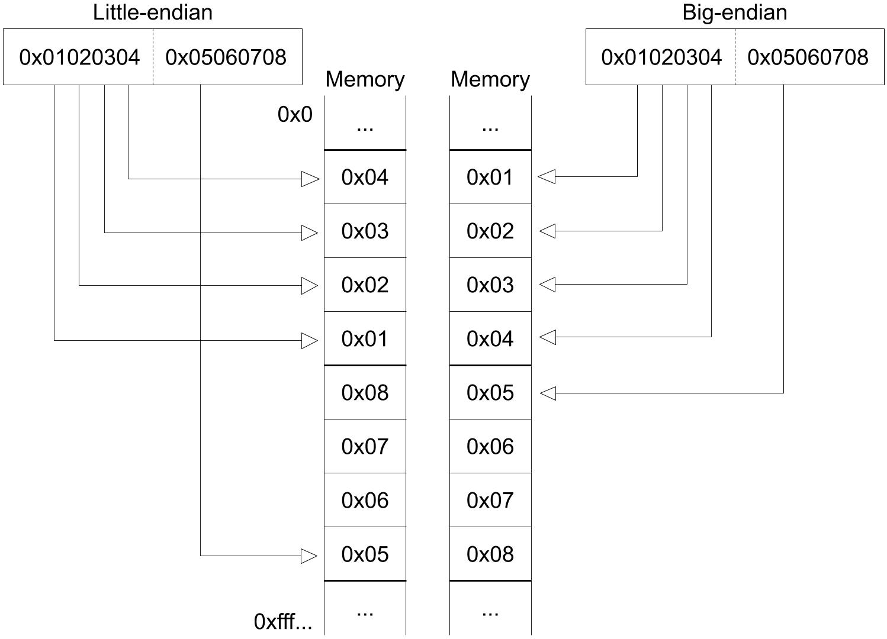
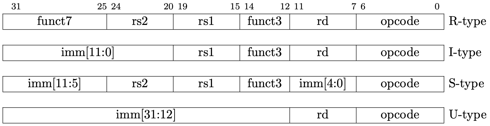
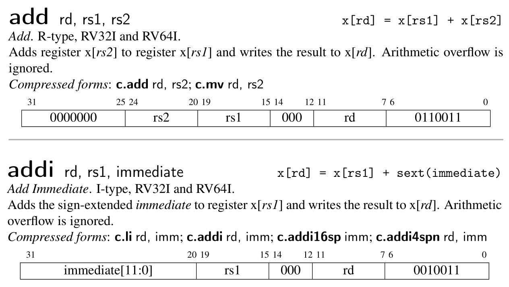

# 加法器 CPU

CPU 指中心处理单元（Center Process Unit），是一块小小的芯片。它是计算机（computer）最核心的部分。

不过，为了简单起见，第一节的 CPU 代指的是整个计算机，它包含了 32 个通用寄存器、一个 PC 寄存器和一块内存。在下一节，我们会将内存移出 CPU。

本节对应原作者的第一节，CPU with Two instructions。这一节的 CPU 只能执行 `add` 和 `addi` 两个指令。

### 编码实现

```bash
# 代码总数
main.rs             : 90
----------------------------
total               : 90
```


首先定义 CPU 的结构

<p class="filename">main.rs</p>

```rs
struct Cpu {
    // Riscv has 32 registers
    regs: [u64; 32],
    // pc register contains the memory address of next instruction
    pc: u64,
    // memory, a byte-array. There is no memory in real CPU.
    dram: Vec<u8>,
}
```

我们需要定义内存的大小，来初始化 CPU。

<p class="filename">main.rs</p>

```rs
// init memory as 128MB
pub const DRAM_SIZE: u64 = 1024 * 1024 * 128;

struct Cpu { ... }

impl Cpu {
    fn new(code: Vec<u8>) -> Self {
        let mut regs = [0; 32];
        regs[2] = DRAM_SIZE - 1;
        Self {regs, pc: 0, dram: code}
    }
}
```


CPU 的工作流程通常包含以下阶段：

1. 根据`pc`值读取内存中的指令 (fetch)
2. 解码指令 (decode)
3. 执行指令 (execute)
4. 更新`pc`

周而复始。

CPU 将`pc`的值发送给内存，内存返回对应的地址上的值。由于指令是 32 位的，因此，内存需要读取的是 [pc, pc+1, pc+2, pc+3] 这四个地址上的值，并组合成一个 32 位的指令。这里有一个大端字节序 (big-endian) 与小端字节序 (small-endian) 的问题。


小端字节序指的是，一个由多个字节组成的数，它的最低位字节存储于内存中的低地址处，最高位字节存储于内存中的高地址处。大端则与之相反。


<p class="comment">图片来自原作者教程</p>

在本实现中，我们采用小端字节序。小端字节序是目前商业芯片的主流。

<p class="filename">main.rs</p>

```rs
impl Cpu {
    // ...
    fn fetch(&self) -> u32 {
        let index = self.pc as usize;
        let inst = self.dram[index] as u32 
                | ((self.dram[index + 1] as u32) << 8)
                | ((self.dram[index + 2] as u32) << 16)
                | ((self.dram[index + 3] as u32) << 24);
        return inst;
    }
}
```

读取指令后就要进行解码。在实际的硬件中，解码是一个独立的步骤，芯片会同时读取和解码多个指令 (pipeline parallel) 以提高运行速度。但在我们的模拟器中，一次只读一个指令，可以将这两部分合并在一起。


我们先看解码过程。Riscv 目前有四种基本的指令编码格式（包含变体共有6种），


<p class="comment">图片来自原作者</p>

现在我们的 CPU 只执行`add`、`addi`，它们的功能说明和指令格式如下：


<p class="comment">图片来自 Riscv Reader</p>


因为各个指令格式都有相同的部分，我们不妨先按 R-type 进行解码。对于其他的类型，则在其具体的分支中进一步解码。比如说，`addi`的`imm`将会在它的处理分支中进行解码。

<p class="filename">main.rs</p>

```rs
impl Cpu {
    // ...
    fn execute(&mut self, inst: u32) {
        // decode as R-type
        let opcode = inst & 0x7f;
        let rd = ((inst >> 7) & 0x1f) as usize;
        let rs1 = ((inst >> 15) & 0x1f) as usize;
        let rs2 = ((inst >> 20) & 0x1f) as usize;
        let funct3 = (inst >> 12) & 0x7;
        let funct7 = (inst >> 25) & 0x7f;

        // x0 is hardwired zero
        self.regs[0] = 0;

        // execute stage
        match opcode {
            0x13 => {
                // addi
                let imm = ((inst & 0xfff0_0000) as i64 >> 20) as u64;
                self.regs[rd] = self.regs[rs1].wrapping_add(imm);
            }
            0x33 => {
                // add
                self.regs[rd] = self.regs[rs1].wrapping_add(self.regs[rs2]);
            }

            _ => {
                dbg!(format!("Invalid opcode: {:#x}", opcode)); 
            }
        }
    }
}
```
这里，我们使用 `wrapping_add` 的原因在于，这两个指令忽略算术溢出错误(arithmetic overflow)，溢出的位(bit)会被直接丢弃（见上面关于这两个指令的说明）。

CPU 的功能基本上完成了。但我们需要能够方便地查看寄存器的状态，以便验证 CPU 是否正确执行了指令。

<p class="filename">main.rs</p>

```rs
impl Cpu {
    // ...
    pub fn dump_registers(&self) {
        let mut output = String::new();
        let abi = [
            "zero", " ra ", " sp ", " gp ", " tp ", " t0 ", " t1 ", " t2 ", 
            " s0 ", " s1 ", " a0 ", " a1 ", " a2 ", " a3 ", " a4 ", " a5 ", 
            " a6 ", " a7 ", " s2 ", " s3 ", " s4 ", " s5 ", " s6 ", " s7 ", 
            " s8 ", " s9 ", " s10", " s11", " t3 ", " t4 ", " t5 ", " t6 ",
        ];
        
        for i in (0..32).step_by(4) {
            let i0 = format!("x{}", i);
            let i1 = format!("x{}", i + 1); 
            let i2 = format!("x{}", i + 2);
            let i3 = format!("x{}", i + 3); 
            let line = format!(
                "{:3}({}) = {:<#18x} {:3}({}) = {:<#18x} {:3}({}) = {:<#18x} {:3}({}) = {:<#18x}\n",
                i0, abi[i], self.regs[i], 
                i1, abi[i + 1], self.regs[i + 1], 
                i2, abi[i + 2], self.regs[i + 2], 
                i3, abi[i + 3], self.regs[i + 3],
            );
            output = output + &line;
        }

        println!("{}", output);
    }
}
```


### 测试

我们通过执行一个 Riscv 二进制文件来验证我们的实现。

创建`add-addi.s`，写入以下内容

```s
addi x29, x0, 5
addi x30, x0, 37
add x31, x30, x29
```

生成 Riscv 二进制文件

```bash
clang -Wl,-Ttext=0x0 -nostdlib --target=riscv64 -march=rv64g -mno-relax -o add-addi add-addi.s
llvm-objcopy -O binary add-addi add-addi.bin
```

同时，模拟器需要读取`add-addi.bin`的内容。

<p class="filename">main.rs</p>

```rs
use std::env;
use std::fs::File;
use std::io;
use std::io::prelude::*;

// ...

fn main() -> io::Result<()> {
    let args: Vec<String> = env::args().collect();

    if args.len() != 2 {
        println!(
            "Usage:\n\
            - cargo run <filename>"
        );
        return Ok(());
    }

    let mut file = File::open(&args[1])?;
    let mut code = Vec::new();
    file.read_to_end(&mut code)?;

    let mut cpu = Cpu::new(code);


    while cpu.pc < cpu.dram.len() as u64 {
        let inst = cpu.fetch();
        cpu.execute(inst);
        cpu.pc += 4;
    }
    cpu.dump_registers();

    Ok(())
}
```

执行
```bash
cargo run add-addi.bin
```

应该能够从控制台的输出中看到`x31`的值为`0x2a`。


### 总结

我们实现了一个加法器 CPU，它可以执行两个 Riscv 指令，`addi`，`add`。我们还学习了 CPU 的执行步骤：取指令，解码，执行，更新ＰＣ。下一节，我们将内存从ＣＰＵ中剥离，并添加更多的指令支持和一个测试的框架。