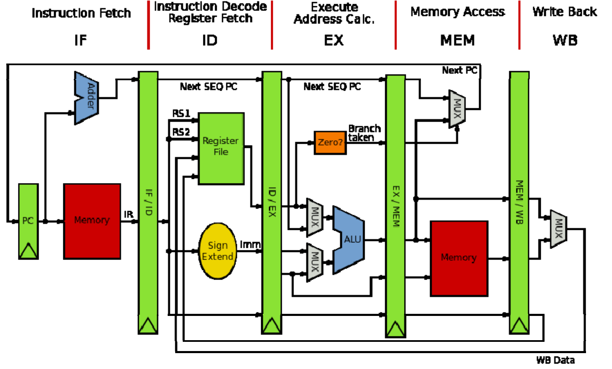

# Adder

CPU (Center Process Unit) is one of the core components of a computer. But in this chapter, we will use `CPU` to denote the whole computer, including 32 common integer registers, a program counter register and a DARM (dynamic random-access memory). In next chapter, we will use bus to connect memory and CPU.

This chapter corresponds to the first chapter *CPU with Two instructions* of the original tutorial by Asami. When finished, our CPU is able to run two instructions: `add` and `addi`.

CPU 指中心处理单元（Center Process Unit），是一块小小的芯片。它是计算机（computer）最核心的部分。

不过，为了简单起见，第一节的 CPU 代指的是整个计算机，它包含了 32 个通用寄存器、一个 PC 寄存器和一块内存。在下一节，我们会将内存移出 CPU。

本节对应原作者的第一节，CPU with Two instructions。这一节的 CPU 只能执行 `add` 和 `addi` 两个指令。

### 1. Basic CPU

Let's define our CPU as follow: It consist of a 64-bit pc register, 32 64-bit integer registers and a DRAM as a vector of u8.

首先定义 CPU 的结构，它包括一个 64 位的 PC，32 个 64 位的通用整数寄存器以及一个用 u8 向量表示的内存。

<p class="filename">main.rs</p>

```rs
struct Cpu {
    // RISC-V has 32 registers
    regs: [u64; 32],
    // pc register contains the memory address of next instruction
    pc: u64,
    // memory, a byte-array. There is no memory in real CPU.
    dram: Vec<u8>,
}
```

We need to define the size of memory to initialize our CPU. Since the stack pointer register `sp` (aka x2) should point to the top address of DRAM. We initialize the `pc` to `0`, means we will start fetch instruction from address 0.

我们需要定义内存的大小来初始化 CPU，因为栈指针 (SP) 需要指向栈顶（内存的最高地址），同时，我们将 PC 置 0，意味着我们的程序将从内存地址 0 处开始执行。

<p class="filename">main.rs</p>

```rs
// init memory as 128MB
pub const DRAM_SIZE: u64 = 1024 * 1024 * 128;

struct Cpu { ... }

impl Cpu {
    fn new(code: Vec<u8>) -> Self {
        let mut regs = [0; 32];
        regs[2] = DRAM_SIZE - 1;
        Self {regs, pc: 0, dram: code}
    }
}
```

### 2. CPU pipeline

Modern CPU spills its execution procedure into several stages to improve throughput and performance. Here is the classic MIPS five-stage pipeline. It consists of:

1. fetch: fetch instruction from memory according to the value of `pc` register.
2. decode: decode instruction so the CPU knows how to execute it.
3. execute: do some computation and get the result.
4. memory access: store value into memory if necessary. 
5. write back: update PC and register file.

CPU do such things again and again.

现代CPU通过将其工作流程划分成多个子过程，以提升其吞吐量和性能。经典的 MIPS 流水线架构包含以下五个部分

1. 取指：根据`pc`值读取内存中的指令 (fetch)
2. 解码：解码指令 (decode)
3. 执行：执行指令 (execute)
4. 访存：将结果写回内存 (memory access)
5. 写回：将运算结果（包括新的PC值）写回寄存器 (write back)

周而复始。



<p class=comment>classic MIPS Pipeline</p>

### 3. Instruction fetch

Let's implement the `fetch` stage firstly.

首先是取指的实现。

<p class="filename">main.rs</p>

```rs
impl Cpu {
    // ...
    fn fetch(&self) -> u32 {
        let index = self.pc as usize;
        let inst = self.dram[index] as u32 
                | ((self.dram[index + 1] as u32) << 8)
                | ((self.dram[index + 2] as u32) << 16)
                | ((self.dram[index + 3] as u32) << 24);
        return inst;
    }
}
```

CPU use `pc` as a base address to fetch 4 continous bytes from DRAM, since RISC-V instruction is 32-bit. Here, we read the `u8` on [pc, pc+1, pc+2, pc+3] and build up a `u32`. What we should be careful is the endianness, which is the term refers to how binary data is stored. There are two types of endianness: little-endianness and big-endianness.

For a multi-byte value, little-endianness stores the least-significant byte at the lowest address and the most-significant byte at the highest address, while big-endianness does the opposite.

In our emulator, we will adopt little-endianness. Although RISC-V supports endianness settings for memory operation, instructions are uniformly little-endian for the benefit of both hardware and software. See RISC-V-Privileged section 3.1.6.4.

CPU 将`pc`的值发送给内存，内存返回对应的地址上的值。由于 RISC-V 指令是 32 位的，因此，内存需要读取的是 [pc, pc+1, pc+2, pc+3] 这四个地址上的值，并组合成一个 32 位的指令。这里有一个大端字节序 (big-endian) 与小端字节序 (small-endian) 的问题。

小端字节序指的是，一个由多个字节组成的数，它的最低位字节存储于内存中的低地址处，最高位字节存储于内存中的高地址处。大端则与之相反。

在本实现中，我们采用小端字节序。在 RISC-V 标准中，指令读取是小端字节序，而内存的加载和储存（memory load and store）则可以通过设置`mstatus`寄存器上特定的位来控制字节序。


<p class="comment">Picture from original author</p>

### 4. Instruction decode

The next stage is instruction decode. In real hardware with pipeline, decoding is a separate step. CPU will fetch next instruction while decoding the current one. But in our emulator, we will simpify these stages by merging decode stage, execute stage and memory access stage into a function `execute`.

There are four basic encoding format in RISC-V. (There are six if we count for the another two variants.) 

读取指令后就要进行解码。在实际的硬件中，解码是一个独立的步骤，芯片会同时读取和解码多个指令 (pipeline parallel) 以提高运行速度。但在我们的模拟器中，一次只读一个指令，可以将这两部分合并在一起。

我们先看解码过程。Riscv 目前有四种基本的指令编码格式（包含变体共有6种），


<p class="comment">Picture from original author</p>

现在我们的 CPU 只执行`add`、`addi`，它们的功能说明和指令格式如下：


<p class="comment">Picture from RISC-V Reader</p>

Designers of RISC-V choose the encoding types carefully to simplify hardware design. All the instructions are 32-bit and the register index is encoding into the same position of different type, which explains why the immediate is spilled into several part in some type.

When implementing, we can firstly decode the instruction as R-type, then decode other information in specific context when necessary. For example, we will decode `imm` of `addi` in its decoding branch.

RISC-V 的设计者出于简化硬件的考虑，将所有的指令编码设计成整齐的 32 位长度。寄存器的编码也尽可能地位于相同的位置，这也是为什么立即数会被切分成多个部分进行编码的原因。

因为各个指令格式都有相同的部分，我们不妨先按 R-type 进行解码。对于其他的类型，则在其具体的分支中进一步解码。比如说，`addi`的`imm`将会在它的处理分支中进行解码。

<p class="filename">main.rs</p>

```rs
impl Cpu {
    // ...
    fn execute(&mut self, inst: u32) {
        // decode as R-type
        let opcode = inst & 0x7f;
        let rd = ((inst >> 7) & 0x1f) as usize;
        let rs1 = ((inst >> 15) & 0x1f) as usize;
        let rs2 = ((inst >> 20) & 0x1f) as usize;
        let funct3 = (inst >> 12) & 0x7;
        let funct7 = (inst >> 25) & 0x7f;

        // x0 is hardwired zero
        self.regs[0] = 0;

        // execute stage
        match opcode {
            0x13 => {
                // addi
                let imm = ((inst & 0xfff0_0000) as i64 >> 20) as u64;
                self.regs[rd] = self.regs[rs1].wrapping_add(imm);
            }
            0x33 => {
                // add
                self.regs[rd] = self.regs[rs1].wrapping_add(self.regs[rs2]);
            }

            _ => {
                dbg!(format!("Invalid opcode: {:#x}", opcode)); 
            }
        }
    }
}
```

Here, we use `wrapping_add` insteal of `+` because RISC-V ignore arithmetic overflow.

Now, our CPU is almost finished. We provide a function to help us to inspect the status of our CPU.

这里，我们使用 `wrapping_add` 的原因在于，这两个指令忽略算术溢出错误(arithmetic overflow)，溢出的位(bit)会被直接丢弃（见上面关于这两个指令的说明）。

CPU 的功能基本上完成了。但我们需要能够方便地查看寄存器的状态，以便验证 CPU 是否正确执行了指令。

<p class="filename">main.rs</p>

```rs
const RVABI: [&str; 32] = [
    "zero", "ra", "sp", "gp", "tp", "t0", "t1", "t2", 
    "s0", "s1", "a0", "a1", "a2", "a3", "a4", "a5", 
    "a6", "a7", "s2", "s3", "s4", "s5", "s6", "s7", 
    "s8", "s9", "s10", "s11", "t3", "t4", "t5", "t6",
];

impl Cpu {
    // ...
    pub fn dump_registers(&mut self) {
        println!("{:-^80}", "registers");
        let mut output = String::new();
        self.regs[0] = 0;

        for i in (0..32).step_by(4) {
            let i0 = format!("x{}", i);
            let i1 = format!("x{}", i + 1); 
            let i2 = format!("x{}", i + 2);
            let i3 = format!("x{}", i + 3); 
            let line = format!(
                "{:3}({:^4}) = {:<#18x} {:3}({:^4}) = {:<#18x} {:3}({:^4}) = {:<#18x} {:3}({:^4}) = {:<#18x}\n",
                i0, RVABI[i], self.regs[i], 
                i1, RVABI[i + 1], self.regs[i + 1], 
                i2, RVABI[i + 2], self.regs[i + 2], 
                i3, RVABI[i + 3], self.regs[i + 3],
            );
            output = output + &line;
        }
        println!("{}", output);
    }
}
```

### 5. Testing

Here, we will simply validate our implementation by executing a pure RISC-V binary. Create a file `add-addi.s` and append the following code.

我们通过执行一个 RISC-V 二进制文件来验证我们的实现。

创建`add-addi.s`，写入以下内容

```s
addi x29, x0, 5
addi x30, x0, 37
add x31, x30, x29
```

We run the following command to generate the pure RISC-V binary, aka the binary file without any header.

生成 RISC-V 二进制文件

```bash
clang -Wl,-Ttext=0x0 -nostdlib --target=riscv64 -march=rv64g -mno-relax -o add-addi add-addi.s
llvm-objcopy -O binary add-addi add-addi.bin
```

At the same time, we need some code to read data from the binary file `add-addi.bin`. Then we initialize our CPU with the code and execute every instruction in it. Finally, we dump out the register information and exit.

同时，模拟器需要读取`add-addi.bin`的内容，并初始化一个 CPU 实例。CPU 逐个读取和执行每个指令，最后打印寄存器状态。

<p class="filename">main.rs</p>

```rs
use std::env;
use std::fs::File;
use std::io;
use std::io::prelude::*;

// ...

fn main() -> io::Result<()> {
    let args: Vec<String> = env::args().collect();

    if args.len() != 2 {
        println!(
            "Usage:\n\
            - cargo run <filename>"
        );
        return Ok(());
    }

    let mut file = File::open(&args[1])?;
    let mut code = Vec::new();
    file.read_to_end(&mut code)?;

    let mut cpu = Cpu::new(code);

    while cpu.pc < cpu.dram.len() as u64 {
        let inst = cpu.fetch();
        cpu.execute(inst);
        cpu.pc += 4;
    }
    cpu.dump_registers();

    Ok(())
}
```

You are expected to see the `x31` register own the value `0x2a` if you execute the following command.

执行以下命令， 应该能够从控制台的输出中看到`x31`的值为`0x2a`。
```bash
cargo run add-addi.bin
```

### 6. Conclusion

We have implemented a adder CPU, it can execute two RISC-V instruction: `addi`, `add`. We learn the CPU work process. In next chapter, we will separate the DRAM from CPU and use a bus to connect them. And we will supports more instruction and build a test framework.

我们实现了一个加法器 CPU，它可以执行两个 RISC-V 指令，`addi`，`add`。我们还学习了 CPU 的执行步骤：取指令，解码，执行，更新ＰＣ。下一节，我们将内存从ＣＰＵ中剥离，并添加更多的指令支持和一个测试的框架。