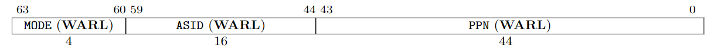
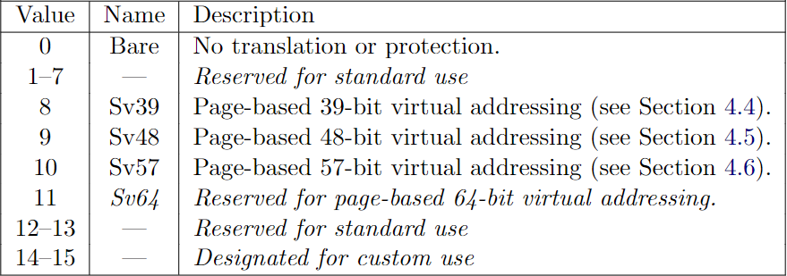

# Page Table

Welcome back! This is the last chapter of this tutorial. We will implement a virtual address system by using a popular data structure: page table.

The main reference the Chapter 3 of the xv6-book, and Section 4.3, 4.4 of RISC-V Privileged.

### 1. SATP

Let's start with the SATP control status register. Refer to the Section 4.1.11 of RISC-V Privileged.

The satp register is a 64-bit read/write register, which controls supervisor-mode address translation and protection. This register holds the physical page number (PPN) of the root page table, i.e., its supervisor physical address divided by 4 KiB; an address space identifier (ASID), which facilitates address-translation fences on a per-address-space basis; and the MODE field, which selects the current address-translation scheme. 

The encoding of MODE field is as follows:

