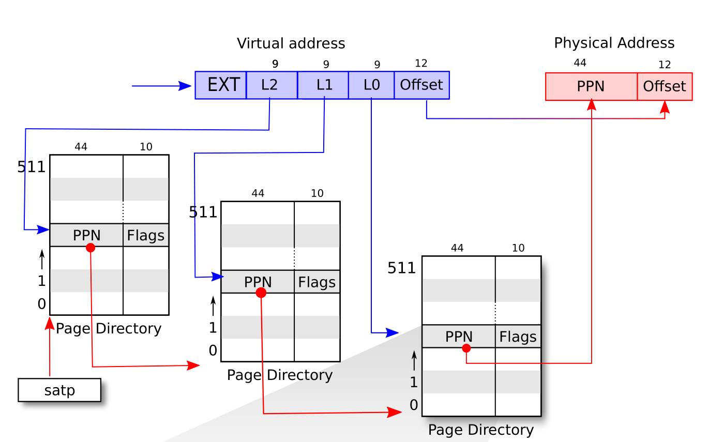
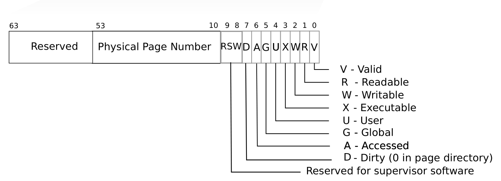

# Page Table

Welcome back! This is the last chapter of this tutorial. We will implement a virtual address system by using a popular data structure: page table.

The main reference are the Chapter 3 of the xv6-book, and Section 4.3, 4.4 of RISC-V Privileged.

欢迎回来！本章是这个教程的最后一章。我们将使用一种流行的数据结构————页表，来实现一个虚拟地址系统。

本章主要参考了 xv6-book 的第三章，以及 RISC-V 特权架构文档的第 4.3，4.4 节。


### 1. SATP

Let's start with the satp control status register. Refer to the Section 4.1.11 of RISC-V Privileged.

The satp register is a 64-bit read/write register, which controls supervisor-mode address translation and protection. This register holds the physical page number (PPN) of the root page table, i.e., its supervisor physical address divided by 4 KiB; an address space identifier (ASID), which facilitates address-translation fences on a per-address-space basis; and the MODE field, which selects the current address-translation scheme. 

首先看下 SATP 寄存器。RISC-V 特权架构文档的第 4.1.11 节中说，satp 是一个 64 位的的可读可写寄存器，用于控制 S-mode 下的地址转换和保护。sapt 存有根页表的 PPN（物理地址页码）。以及一个用于地址同步地址空间 ID，还有一个 MODE 字段，用于选择当前所使用的地址转换方案。


<p class="comment">SATP register: From RISC-V Privileged</p>

The encoding of MODE field is as follows: 

MODE 字段的编码如下所示


<p class="comment">encoding of MODE field: From RISC-V Privileged</p>

We will implement the Sv39 (MODE = 8) in our emulator. Sv39 means that only the bottom 39 bits of a 64-bit virtual address are used; the top 25 bits are not used. 

我们在模拟器中实现的是 Sv39 (MODE = 8)。Sv39 的意思是，64 位的虚拟地址中，只有 39 位被用到，其余的 25 位没有被使用。

### 2. Page Table and Address Translation

In this Sv39 configuration, a RISC-V page table is logically an array of 2^27 (134,217,728) page table entries (PTEs). Each PTE contains a 44-bit physical page number (PPN) and some flags. The paging hardware translates a virtual address by using the top 27 bits of the 39 bits to index into the page table to find a PTE, and making a 56-bit physical address whose top 44 bits come from the PPN in the PTE and whose bottom 12 bits are copied from the original virtual address.

在 Sv39 中，RISC-V 页表逻辑上是一个 PTE（页表入口）数组，数组大小为 2 的 27 次幂。每个 PTE 由 44 位的 PPN 和一些标志位组成。硬件使用 39 位虚拟地址的前 27 位来索引 PTE。并使用 PTE 的 PPN 字段以及虚拟地址中的 Offset 字段（12位）来构成一个 56 位的物理地址。




<p class="comment">RISC-V address translation details: From xv6-book</p>


Each PTE contains flag bits that tell the paging hardware how the associated virtual address is allowed to be used. PTE_V indicates whether the PTE is present: if it is not set, a reference to the page causes an exception (i.e. is not allowed). PTE_R controls whether instructions are allowed to read to the page. PTE_W controls whether instructions are allowed to write to the page. PTE_X controls whether the CPU may interpret the content of the page as instructions and execute them.  PTE_U controls whether instructions in user mode are allowed to access the page; if PTE_U is not set, the PTE can be used only in supervisor mode.

When all three PTE_X, PTE_W, PTE_R bits are zero, the PTE is a pointer to the next level of the page table; otherwise, it is a leaf PTE. 

Any level of PTE may be a leaf PTE, so in addition to 4 KiB pages, Sv39 supports 2 MiB megapages and 1 GiB gigapages. We call them superpages.

To tell the hardware to use a page table, the kernel must write the physical address of the root page-table page into the satp register. We summarize the translation process of a virtual address va (which consists of EXT, L2, L1, L0 and Offset) as follows: 

1. Read satp.ppn, which points to the root page table pt0. (Each page table contains 512 address.)
2. Use va.L2 to index into a PTE pte0 of pt0. 
3. The pt0.ppn points to the intermediate page table pt1.
4. Use va.L1 to index into a PTE pte1 of pt1. 
5. The pt1.ppn points to the last page table pt2.
6. Use va.L0 to index into a PTE pte2 of pt2. 
7. The pte2 should be a leaf pte.
8. Use pte2.ppn concatenate with va.offset to build the final physical address.

Note that all the PTE should be valid; otherwise, a page fault exception should be thrown.

What I show above is a simplified process. Please refer to the Section 4.3.2 *Virtual Address Translation Process* of RISC-V Privileged for more details.

### 3. Implementation

We defines the translation function as follows:

<p class=filename>cpu.rs</p>

```rs
impl Cpu {
    pub fn translate(&mut self, addr: u64, access_type: AccessType) -> Result<u64, Exception> { /*...*/ }
}
```

Function `translate` takes a virtual address and return a physical address if succeeds. It also needs to know the access type so it can raise a corresponding page fualt exception when it encounters an error. 

There are three types of accessments.

<p class=filename>cpu.rs</p>

```rs
pub enum AccessType {
    Instruction,
    Load,
    Store,
}
```

We need to update CPU to include some paging facilities.

<p class=filename>cpu.rs</p>

```rs
pub struct Cpu {
    pub regs: [u64; 32],
    pub pc: u64,
    pub mode: Mode,
    pub bus: Bus,
    pub csr: Csr,
    pub enable_paging: bool,
    pub page_table: u64,
}

impl Cpu {
    pub fn new(code: Vec<u8>, disk_image: Vec<u8>) -> Self {
        let mut regs = [0; 32];
        regs[2] = DRAM_END;
        let pc = DRAM_BASE;
        let bus = Bus::new(code, disk_image);
        let csr = Csr::new();
        let mode = Machine;
        let page_table = 0;
        let enable_paging = false;

        Self {regs, pc, bus, csr, mode, page_table, enable_paging}
    }
}
```

We will enable paging if satp is set properly. Since satp is a CSR, we will update paging when a CSR instruction is executed. (make a call of the following method before returning from six CSR instructions branch.)

<p class=filename>cpu.rs</p>

```rs
impl Cpu {
    fn update_paging(&mut self, csr_addr: usize) {
        if csr_addr != SATP { return; }

        let satp = self.csr.load(SATP);
        self.page_table = (satp & MASK_PPN) * PAGE_SIZE;

        let mode = satp >> 60;
        self.enable_paging = mode == 8; // Sv39
    }
}
```

The original author implement the `translate` according to Section 4.3.2 and support superpages. We will keep on this.

Firstly, if paging is not enabled, just return original address.

<p class=filename>cpu.rs</p>

```rs
impl Cpu {
    pub fn translate(&mut self, addr: u64, access_type: AccessType) -> Result<u64, Exception> {
        if !self.enable_paging {
            return Ok(addr);
        }
        // ... TO BE CONTINUE ...
    }
}
```

Otherwise, we will translate the address. Since Sv39 has three levels of translation. 

<p class=filename>cpu.rs</p>

```rs
impl Cpu {
    pub fn translate(&mut self, addr: u64, access_type: AccessType) -> Result<u64, Exception> {
        // ...
        let levels = 3;
        let vpn = [
            (addr >> 12) & 0x1ff,       // L0
            (addr >> 21) & 0x1ff,       // L1
            (addr >> 30) & 0x1ff,       // L2
        ];

        let mut a = self.page_table;
        let mut i: i64 = levels - 1;
        let mut pte;
        // ... TO BE CONTINUE ...
    }
}
```

Next comes a loop to find the leaf PTE. 

<p class=filename>cpu.rs</p>

```rs
impl Cpu {
    pub fn translate(&mut self, addr: u64, access_type: AccessType) -> Result<u64, Exception> {
        // ...
        loop {
            // Let pte be the value of the PTE at address a+va.vpn[i]×PTESIZE. (For Sv39,
            // PTESIZE=8.) If accessing pte violates a PMA or PMP check, raise an access
            // exception corresponding to the original access type.
            pte = self.bus.load(a + vpn[i as usize] << 3, 64)?;

            // If pte.v = 0, or if pte.r = 0 and pte.w = 1, stop and raise a page-fault
            // exception corresponding to the original access type.
            let v = pte & 1;
            let r = (pte >> 1) & 1;
            let w = (pte >> 2) & 1;
            let x = (pte >> 3) & 1;
            if v == 0 || (r == 0 && w == 1) {
                match access_type {
                    AccessType::Instruction => return Err(Exception::InstructionPageFault(addr)),
                    AccessType::Load => return Err(Exception::LoadPageFault(addr)),
                    AccessType::Store => return Err(Exception::StoreAMOPageFault(addr)),
                }
            }

            // Otherwise, the PTE is valid. If pte.r = 1 or pte.x = 1, go to step 5.
            // Otherwise, this PTE is a pointer to the next level of the page table.
            // Let i = i − 1. If i < 0, stop and raise a page-fault exception
            // corresponding to the original access type. Otherwise,
            // let a = pte.ppn × PAGESIZE and go to step 2."
            if r == 1 || x == 1 {
                break;
            }

            // go to next level
            i -= 1;
            let ppn = (pte >> 10) & 0x0fff_ffff_ffff;
            a = ppn * PAGE_SIZE;
            if i < 0 {
                match access_type {
                    AccessType::Instruction => return Err(Exception::InstructionPageFault(addr)),
                    AccessType::Load => return Err(Exception::LoadPageFault(addr)),
                    AccessType::Store => return Err(Exception::StoreAMOPageFault(addr)),
                }
            }
        }
        // ... TO BE CONTINUE ...
    }
}
```

Finally, we construct the physical address depending on whether a page is superpage (indicated by the value of `i`).

<p class=filename>cpu.rs</p>

```rs
impl Cpu {
    pub fn translate(&mut self, addr: u64, access_type: AccessType) -> Result<u64, Exception> {
        // ...
        // A leaf PTE has been found.
        let ppn = [
            (pte >> 10) & 0x1ff,
            (pte >> 19) & 0x1ff,
            (pte >> 28) & 0x03ff_ffff,
        ];

        // The translation is successful. The translated physical address is given as follows:
        // • pa.pgoff = va.pgoff.
        // • If i > 0, then this is a superpage translation and pa.ppn[i−1:0] = va.vpn[i−1:0].
        // • pa.ppn[LEVELS−1:i] = pte.ppn[LEVELS−1:i]."
        let offset = addr & 0xfff;
        match i {
            0 => {
                let ppn = (pte >> 10) & 0x0fff_ffff_ffff;
                Ok((ppn << 12) | offset)
            }
            1 => { // Superpage translation. 2 MiB
                Ok((ppn[2] << 30) | (ppn[1] << 21) | (vpn[0] << 12) | offset)
            }
            2 => { // Superpage translation. 1 GiB
                Ok((ppn[2] << 30) | (vpn[1] << 21) | (vpn[0] << 12) | offset)
            }
            _ => match access_type {
                AccessType::Instruction => return Err(Exception::InstructionPageFault(addr)),
                AccessType::Load => return Err(Exception::LoadPageFault(addr)),
                AccessType::Store => return Err(Exception::StoreAMOPageFault(addr)),
            },
        }
    }
}
```

The translation is complete right now. To enable paging, we also need to update the `fetch`, `load`, `store` methods of CPU.
```rs
impl Cpu {
    /// Load a value from a dram.
    pub fn load(&mut self, addr: u64, size: u64) -> Result<u64, Exception> {
        let p_addr = self.translate(addr, AccessType::Load)?;
        self.bus.load(p_addr, size)
    }

    /// Store a value to a dram.
    pub fn store(&mut self, addr: u64, size: u64, value: u64) -> Result<(), Exception> {
        let p_addr = self.translate(addr, AccessType::Store)?;
        self.bus.store(p_addr, size, value)
    }

    /// Get an instruction from the dram.
    pub fn fetch(&mut self) -> Result<u64, Exception> {
        let p_pc = self.translate(self.pc, AccessType::Instruction)?;
        match self.bus.load(p_pc, 32) {
            Ok(inst) => Ok(inst),
            Err(_e) => Err(Exception::InstructionAccessFault(self.pc)),
        }
    }
}
```

### 4. Run xv6 up!

Ideally, we should compile the xv6 kernel and build filesystem image from the xv6 source. I have tried to do this but failed. The emulator encounters an illegal instruction exception. Therefore, I will use the xv6 kernel binary and filesystem image provided by the original author.

Since I omit some modifications when I wrote this tutorial. Your run of `cargo run xv6-kernel.bin fs.img` may fail. If so, fix them and try again. Refer to my code if necessary.

Finally, you can run `cargo build --release` to get an optimized version and run the `usertests` of xv6.


### 5. Conclusion

You are done!

The emulator is completed and able to run xv6 up. Our emulator is small size. If we ignore the comments and the test code, it only contains 1460 lines of code (including lines which only contain a single `}`).

```rs
bus.rs              : 45
clint.rs            : 33
cpu.rs              : 777
csr.rs              : 106
dram.rs             : 37
exception.rs        : 88
interrupt.rs        : 23
main.rs             : 63
param.rs            : 50
plic.rs             : 38
uart.rs             : 80
virtio.rs           : 87
virtqueue.rs        : 33
----------------------------
total               : 1460
```

As we have already mentioned, the emulator is not perfect. 

+ It only supports a hart and we have implemented many instruction as nop. 
+ The devices (PLIC, CLINT, VirtIO) are simplified. Timer interrupt is not supported.
+ It does not support network.
+ It does not support VGA device.
+ ...

There is another open-source, tiny RISC-V emulator named [TinyEMU](https://bellard.org/tinyemu/), written by Fabrice Bellard, the original author of QEMU, features as:

+ support 32/64/128 bit integer registers
+ support 32/64/128 bit floating point instructions
+ support compressed instructions
+ support VirtIO console, network, block device, input and 9P filesystem
+ support graphical display with SDL
+ dynamic XLEN change
+ written in C
+ JS version can run Linux and Windows 2000

It is interesting to rewrite it in Rust! 

Additionally, the following courses may be useful:

+ [MIT 6.S081](https://pdos.csail.mit.edu/6.828/2021/tools.html)
+ [rust-based-os-comp2022](https://github.com/LearningOS/rust-based-os-comp2022)


### 6. Postscript

I have many thanks to the original author [Asami](https://github.com/d0iasm). Writing such a tutorial forces me to read the RISC-V Spec carefully and other relevant documentations many times. I have finished the labs of xv6 formerly and when I return to read the xv6 book again, I recognize many details I used to ignore. By the way, I have also learned something new about Rust, such as cast an address to a type reference and multithread.

I hope this tutorial can bring you with luck. Thanks for your reading.