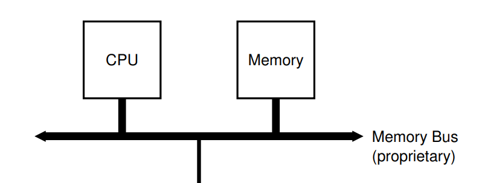
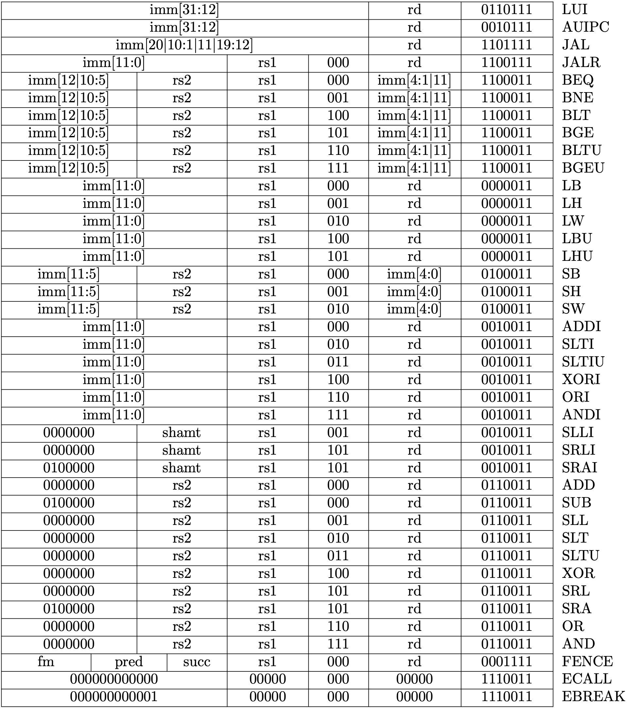

# Memory and Bus
内存和总线

In last chapter, our CPU contains a DRAM. But in real hardware, they are connected by the bus and exchange data through the bus.

在上一节，我们把内存和 CPU 放在同一个结构体中，但在真实的硬件中，这两部分是分开的。CPU 和内存通过总线（bus）进行数据交换。如下图所示：


<p class="comment">Picture from Operation System: Three Easy Pieces</p>

### 1. Connect CPU and DRAM by Bus

Thus, we have defined thw following struct.

因此，我们定义以下结构：

<p class="filename">cpu.rs</p>

```rs
pub struct Cpu {
    pub regs: [u64; 32],
    pub pc: u64,
    pub bus: Bus,
}
```
Now, CPU contains a bus instead of DRAM. There are possible many devices connected on bus. But we have only one device (DRAM) right now.

CPU 现在不包含内存，而是连接了总线。总线上可能有多个 IO 设备，但目前我们只有一个（DRAM）。

<p class="filename">bus.rs</p>

```rs
pub struct Bus {
    dram: Dram,
}
```

<p class="filename">dram.rs</>

```rs
pub struct Dram {
    pub dram: Vec<u8>,
}
```

### 2. Memory API

Memory has two function: `store` and `load`. Only store and load a 8-bit, 16-bit, 32-bit and 64-bit are allowed. Recall that we use little-endian byte ordering. We implement the memory API as following:

内存（DRAM）只有两个功能：store，load。保存和读取的有效位数是 8，16，32，64。回顾上一节，我们采用的是小端字节序。实现如下

<p class="filename">dram.rs</>

```rs

impl Dram {
    pub fn new(code: Vec<u8>) -> Dram {
        let mut dram = vec![0; DRAM_SIZE as usize];
        dram.splice(..code.len(), code.into_iter());
        Self { dram }
    }

    // addr/size must be valid. Check in bus
    pub fn load(&self, addr: u64, size: u64) -> Result<u64, Exception> {
        if ![8, 16, 32, 64].contains(&size) {
            return Err(LoadAccessFault(addr));
        }
        let nbytes = size / 8;
        let index = (addr - DRAM_BASE) as usize;
        let mut code = self.dram[index] as u64;
        // shift the bytes to build up the desired value
        for i in 1..nbytes {
            code |= (self.dram[index + i as usize] as u64) << (i * 8);
        }

        return Ok(code);
    }

    // addr/size must be valid. Check in bus
    pub fn store(&mut self, addr: u64, size: u64, value: u64) -> Result<(), Exception> {
        if ![8, 16, 32, 64].contains(&size) {
            return Err(StoreAMOAccessFault(addr));
        }
        let nbytes = size / 8;
        let index = (addr - DRAM_BASE) as usize;
        for i in 0..nbytes {
            let offset = 8 * i as usize;
            self.dram[index + i as usize] = ((value >> offset) & 0xff) as u8;
        }
        return Ok(())
    }
}
```

Here, we have use some global value and `Exception`. They are in `param.rs` and `exception.rs`.  We won't talk about Exception until Chapter 5. For now, we only need three exception type:

这里用到了一些全局变量和异常，定义在 `param.rs` 和 `exception.rs` 中，我们将会在第五章的时候讨论异常。现在只需要了解以下三种异常即可。

+ LoadAccessFault
+ StoreAMOAccessFault
+ IllegalInstruction

Refer to RISC-V Specification if you are curious. 如果你是好奇宝宝，可以去看下 RISC-V 标准。


The `param.rs` contains the following code. We choose `DRAM_BASE` the same value, 0x8000_0000, as in qemu. It will be the initial value of the PC register.

`param.rs` 中包含了以下代码。我们选择了跟 QEMU 一样的内存起始地址 0x8000_0000。PC 寄存器初始化的时候会被赋予这个值。

<p class="filename">param.rs</p>

```rs
pub const DRAM_BASE: u64 = 0x8000_0000;
pub const DRAM_SIZE: u64 = 1024 * 1024 * 128;
pub const DRAM_END: u64 = DRAM_SIZE + DRAM_BASE - 1;
```


### 3. Bus API

Bus is a communication medium of CPU and various IO devices. Bus allocates different address for differet devices. By sending instruction through bus, CPU can operate the IO devices indirectly. 

Bus also provides two function: `store` and `load`.

总线是 CPU 与各种 IO 设备（如键盘、鼠标、屏幕等）通信的渠道。总线上不同的地址范围对应了不同的设备。CPU 通过给总线发指令来间接操作其他的设备。

总线同样仅提供两个操作：store，load。

<p class="filename">bus.rs</p>

```rs
impl Bus {
    pub fn new(code: Vec<u8>, disk_image: Vec<u8>) -> Bus {
        Self { dram: Dram::new(code) }
    }
    pub fn load(&mut self, addr: u64, size: u64) -> Result<u64, Exception> {
        match addr {
            DRAM_BASE..=DRAM_END => self.dram.load(addr, size),
            _ => Err(Exception::LoadAccessFault(addr)),
        }
    }

    pub fn store(&mut self, addr: u64, size: u64, value: u64) -> Result<(), Exception> {
        match addr {
            DRAM_BASE..=DRAM_END => self.dram.store(addr, size, value),
            _ => Err(Exception::StoreAMOAccessFault(addr)),
        }
    }
}
```

### 4. CPU API

CPU loads and stores data through the bus connected to it. Note that our CPU will start execution at address DRAM_BASE from now on.

现在 CPU 不直接读写内存，而是通过向总线发指令来读写内存。现在我们的 CPU 将会从 DRAM_BASE 处开始执行。

<p class="filename">cpu.rs</p>

```rs
impl Cpu {
    pub fn new(code: Vec<u8>) -> Self {
        let mut regs = [0; 32];
        regs[2] = DRAM_END;
        let bus = Bus::new(code);
        Self {regs, pc: DRAM_BASE, bus}
    }

    /// Load a value from a dram.
    pub fn load(&mut self, addr: u64, size: u64) -> Result<u64, Exception> {
        self.bus.load(addr, size)
    }

    /// Store a value to a dram.
    pub fn store(&mut self, addr: u64, size: u64, value: u64) -> Result<(), Exception> {
        self.bus.store(addr, size, value)
    }

    /// Get an instruction from the dram.
    pub fn fetch(&mut self) -> Result<u64, Exception> {
        self.bus.load(self.pc, 32)
    } 
```


Now, we have finished code refactoring. To run the example in last chapter, we have to modify `main.rs`. You may want to refer the code in according folder.

至此，我们已经完成将内存剥离 CPU 的重构工作。我们需要对`main.rs`进一步修改，以便成功运行上一节的汇编程序。你可能想参考一下对应文件夹下的代码。


### 5. Return new PC value

Recall that, the final stage of a five-stage pipeline introduced in last chapter is `Write Back`. In this stage, the address of next instruction is written into the PC register. We will imitate such a behaviour by returning a new pc value from the `execute` function. 

We need to do such a change because we are going to support more instructions, including branch instructions, which decides the next PC value according to the condition. We can not simply add 4 get the next PC value right now.

We change our `execute` function as following:

回顾上一节介绍的五阶段流水线，最后一个阶段是写回。在这个阶段，新的 PC 值会被写回 PC 寄存器。我们通过让 `execute` 函数返回一个新的 PC 值来模拟这一行为。之所以要这么做，是因为我们准备支持更多的指令，其中包括分支跳转指令。这些指令会改变 PC 的值。因此，我们无法通过原 PC 值加 4 来得到新的 PC 值。
新的 `execute` 定义如下：

```rs
impl Cpu {
    // ...
    pub fn execute(&mut self, inst: u64) -> Result<u64, Exception> { 
        //... 
    }
}
```

Besides, we update PC register using the value returned from `execute` in `main.rs`:

同时，在`main.rs`，我们用新的 execute 的返回值来更新 PC 寄存器。

```rs
fn main() {
    // ...
    loop {
        let inst = match cpu.fetch() {
            Ok(inst) => inst,
            Err(e) => { break; }
        };

        match cpu.execute(inst) {
            Ok(new_pc) => cpu.pc = new_pc,
            Err(e) => { break; }
        };
    }
}
```


### 6. Support new instructions
We will support following instructions in this chapter.

这一节我们将支持以下指令



<p class="comment">Picture from original author</p>


<p class="comment">Picture from original author</p>


It is impractical to explain every instruction here. `RISC-V reader` is a helpful reference if you want to implement every instruction by yourself. In fact, I almost copy the code from [Asami](https://github.com/d0iasm), the original author :).  Nevertheless, I have provided a test framework (see below) and you are really encouraged to implement the instruction by yourself.

在教程中逐个解释逐个实现是不切实际的。如果你想自己一个个实现，RISC-V Reader 附录的指令说明会是一个不错的参考。实际上，我基本直接复制了[原作者](https://github.com/d0iasm)的代码。尽管如此，我写了一个测试框架（在后文），可以帮助你验证自己的实现。


### 7. Testing

We need to add some tests to ensure our implementation is correct. In last chapter, we generate pure RISC-V binary by `clang` and `llvm-objcopy`. We will make the following procedure automatically to ease the testing of our code. 

我们需要对指令的解释做单元测试，以便我们排查 BUG。在上一节，我们通过`clang`，`llvm-objcopy`来生成二进制代码。现在我们将以下过程自动化以便于我们在代码中添加测试。

```bash
clang -S simple.c -nostdlib -march=rv64i -mabi=lp64 -mno-relax
clang -Wl,-Ttext=0x0 -nostdlib -march=rv64i -mabi=lp64 -mno-relax -o simple simple.s
llvm-objcopy -O binary simple simple.bin
```

The first command generates the assembly code, then the second command generates a binary file in ELF format. Finally, the third command remove the ELF header and a RISC-V pure binary is generated. Implementation is as follow:

其中第一行从C代码中生成汇编代码，第二行编译成了一个ELF格式的二进制文件，第三行去掉了ELF格式，只保存了其中的二进制代码。我们分别实现如下：


<p class="filename">cpu.rs</p>

```rs
#[cfg(test)]
mod test {
    use std::fs::File;
    use std::io::{Write, Read};
    use std::process::Command;
    use super::*;

  fn generate_rv_assembly(c_src: &str) {
        let cc = "clang";
        let output = Command::new(cc).arg("-S")
                            .arg(c_src)
                            .arg("-nostdlib")
                            .arg("-march=rv64g")
                            .arg("-mabi=lp64")
                            .arg("--target=riscv64")
                            .arg("-mno-relax")
                            .output()
                            .expect("Failed to generate rv assembly");
        println!("{}", String::from_utf8_lossy(&output.stderr));
    }

    fn generate_rv_obj(assembly: &str) {
        let cc = "clang";
        let pieces: Vec<&str> = assembly.split(".").collect();
        let output = Command::new(cc).arg("-Wl,-Ttext=0x0")
                            .arg("-nostdlib")
                            .arg("-march=rv64g")
                            .arg("-mabi=lp64")
                            .arg("--target=riscv64")
                            .arg("-mno-relax")
                            .arg("-o")
                            .arg(&pieces[0])
                            .arg(assembly)
                            .output()
                            .expect("Failed to generate rv object");
        println!("{}", String::from_utf8_lossy(&output.stderr));
    }

    fn generate_rv_binary(obj: &str) {
        let objcopy = "llvm-objcopy";
        let output = Command::new(objcopy).arg("-O")
                                .arg("binary")
                                .arg(obj)
                                .arg(obj.to_owned() + ".bin")
                                .output()
                                .expect("Failed to generate rv binary");
        println!("{}", String::from_utf8_lossy(&output.stderr));
    }
}
```

Aimed with the auxiliary function above, we can let the CPU running up. 有了以上辅助函数之后，我们可以让 CPU 跑起来。

<p class="filename">cpu.rs</p>

```rs
mod test {
    // ...
       fn rv_helper(code: &str, testname: &str, n_clock: usize) -> Result<Cpu, std::io::Error> {
        let filename = testname.to_owned() + ".s";
        let mut file = File::create(&filename)?;
        file.write(&code.as_bytes())?;
        generate_rv_obj(&filename);
        generate_rv_binary(testname);
        let mut file_bin = File::open(testname.to_owned() + ".bin")?;
        let mut code = Vec::new();
        file_bin.read_to_end(&mut code)?;
        let mut cpu = Cpu::new(code, vec![]);

        for _i in 0..n_clock {
            let inst = match cpu.fetch() {
                Ok(inst) => inst,
                Err(_err) => break,
            };
            match cpu.execute(inst) {
                Ok(new_pc) => cpu.pc = new_pc,
                Err(err) => println!("{}", err),
            };
        }

        return Ok(cpu);
    }
}
```

The code above writes the RISC-V assembly code into a file and generate a pure binary file. Then a CPU is created and execute for `n_clock`. Finally, the CPU is returned because we want to check its status.

Now, we can add a simple test for `addi`.

以上代码将 Riscv 汇编代码写入文件，并生成相应的二进制代码文件，然后创建一个 CPU 进行执行，最终返回该 CPU 实例。

现在，我们对`addi`添加一个简单的测试。

<p class="filename">cpu.rs</p>

```rs
mod test {
    // ...
    #[test]
    fn test_addi() {
        let code = "addi x31, x0, 42";
        match rv_helper(code, "test_addi", 1) {
            Ok(cpu) => assert_eq!(cpu.regs[31], 42),
            Err(e) => { println!("error: {}", e); assert!(false); }
        }
    }
}
```

Running the test by 执行测试

```sh
cargo test
```


### 8. Macro `riscv_test` for easier testing

We use the following macro to abstract the testing procedure.

以下宏用于简化测试过程。关于宏，我以前在[一篇博文](https://zhuanlan.zhihu.com/p/260707957)中写过一段简短的解释。故不赘述。

<p class="filename">cpu.rs</p>

```rs
mod test {
    // ...
    macro_rules! riscv_test {
        ( $code:expr, $name:expr, $clock:expr, $($real:expr => $expect:expr),* ) => {
            match rv_helper($code, $name, $clock) {
                Ok(cpu) => { 
                    $(assert_eq!(cpu.reg($real), $expect);)*
                }
                Err(e) => { println!("error: {}", e); assert!(false); }
            } 
        };
    }
}
```

We need another function for easier register lookup. 我们需要另一个函数来方便我们查看寄存器的值。

```rs
impl Cpu {
    // ...
    pub fn reg(&self, r: &str) -> u64 {
        match RVABI.iter().position(|&x| x == r) {
            Some(i) => self.regs[i],
            None => match r {
                "pc" => self.pc,
                "fp" => self.reg("s0"),
                r if r.starts_with("x") => {
                    if let Ok(i) = r[1..].parse::<usize>() {
                        if i <= 31 { return self.regs[i]; }
                        panic!("Invalid register {}", r);
                    }
                    panic!("Invalid register {}", r);
                }
                _ => panic!("Invalid register {}", r),
            }
        }
    }
}
```

With the `riscv_test` macro and `reg` function, we can simplify the test as follow:

有了 riscv_test 宏以及 reg 函数，以上的测试可以简化成这样：

```rs
mod test {
    //...
    #[test]
    fn test_addi() {
        let code = "addi x31, x0, 42";
        riscv_test!(code, "test_addi", 1, "x31" => 42);
    }
}
```

### Conclusion

We have performed code refactoring to the CPU structure by using bus to connect the CPU and DRAM. We will add more devices on bus. Besides, we imitate the `Write Back` stage by returning a new PC value from `execute`. We also support more instructions and design a test framework to ease testing. On next chapter, we will add the `Control Status Register` to CPU and support corresponding instruction.

我们重构了 CPU 的结构，总线连接了 CPU 和内存。后续我们还会添加更多的设备到总线上。同时，我们模拟了写回阶段，`execute`函数返回一个新的PC值用于PC寄存器的更新。此外，我们实现了一个测试框架，便于及时验证我们的实现。在下一节中，我们将添加对控制状态寄存器（Control Status Register）的读写支持。