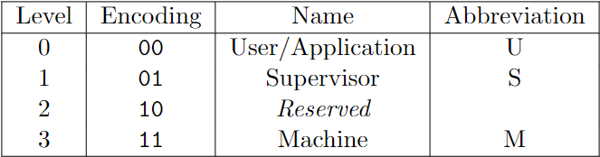
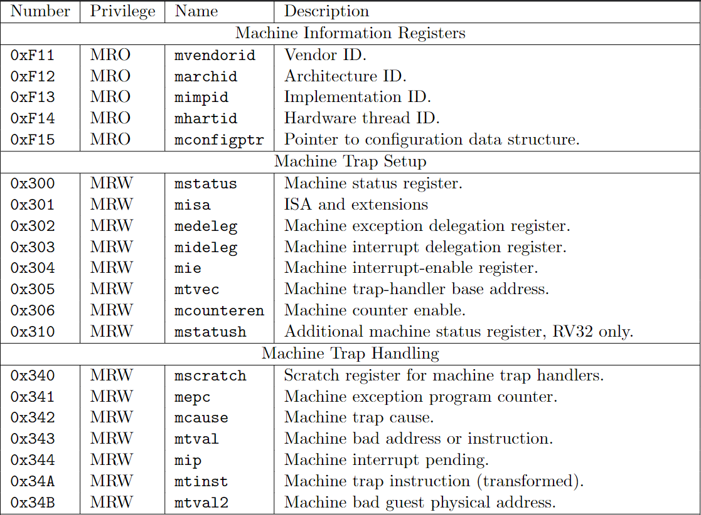
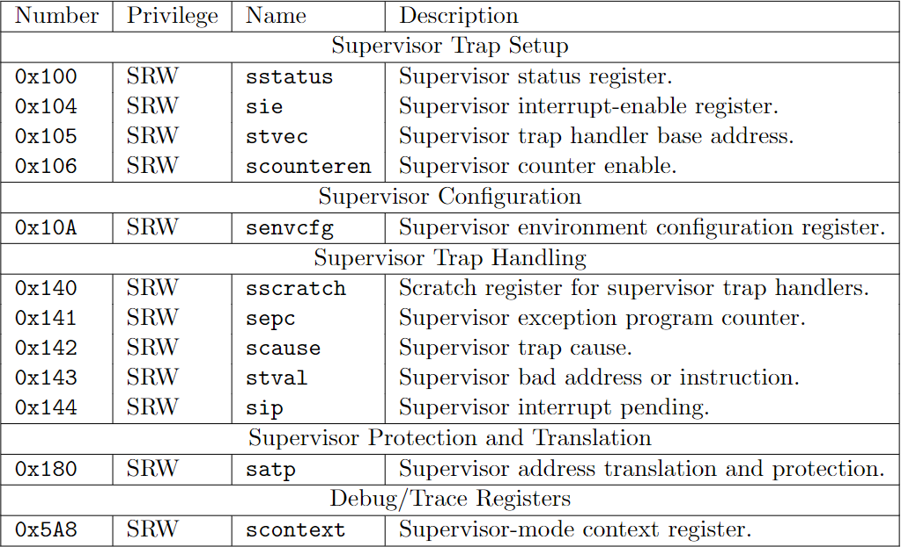
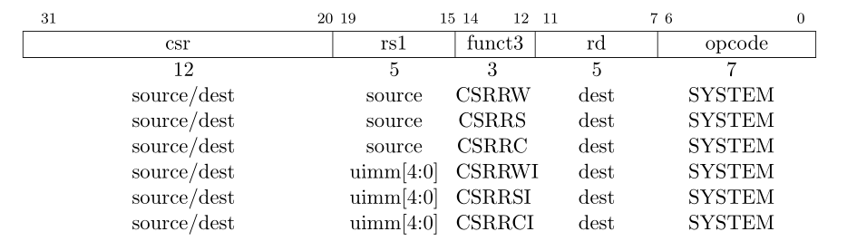
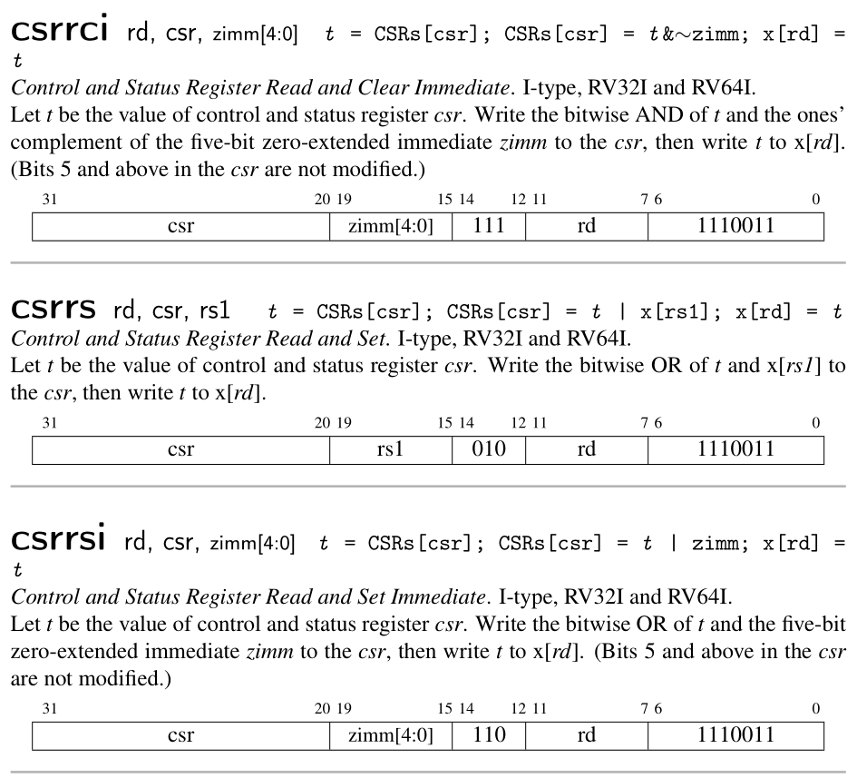
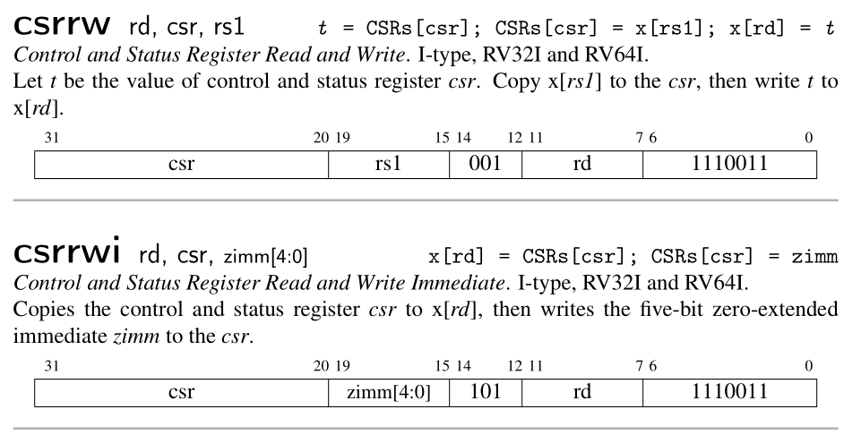

# Control Status Register

RISC-V defines a separate address space of 4096 Control and Status registers associated with each hart. This chapter focuses on the CSR instructions that operate on these CSRs, which are defined in Chapter 9 of RISC-V unprivileged ISA. We will talk more about the functionality of these CSRs in chapter 4 and chapter 5.

RISC-V has defined three privilege level. At any time, a RISC-V hardware thread (hart) is running at some privilege level encoded as a mode
in one or more CSRs. We will talk more about privilege levels in next chapter.

RISC-V 为每一个 hart 定义了一个独立的控制状态寄存器的地址空间，有 4096 个之多。本章主要着重于实现相应的指令集，这部分内容在 RISC-V 非特权 ISA 标准的第九章中。我们将会在第四和第五章讨论这些寄存器的功能。

RISC-V 定义了三种特权等级。在任意时刻，一个 hart 总是跑在某种特权等级上。这个特权等级编码在一个或者多个控制状态寄存器之中。我们会在下一章节中讨论特权等级。


<p class="comment">Picture from RISC-V Privileged</p>

### 1. CSRs

The table below includes all the CSRs we need in this tutorial. I suggest you stop to read the corresponding chapter in RISC-V privileged if you are curious.

下表基本包含了我们这个小项目需要用到的（也就是 xv6 所需要的）寄存器。你可以停下来去翻翻 RISC-V 特权标准中的相关的章节。


<p class="comment">Picture from RISC-V Privileged</p>


<p class="comment">Picture from RISC-V Privileged</p>


What I want to point out is that the `sie`, `sip` and `sstatus` is the restricted view of `mie`, `mip` and `mstatus`. In a straightforward implementation, reading or writing any field in sie, sip, sstatus is equivalent to reading or writing the homonymous field in mie, mip and mstatus respectively.

我想指出的是，sie，sip，sstatus 是 mie，mip，mstatus 的子集。在一个简单的实现中，读写 sie，sip，sstatus 中的任意字段相当于读写 mie，mip，mstatus 中对应的字段。

### 2. CSRs' address

Firstly, let's record the address of the CSRs we need.

根据上表，我们先录入所需要的寄存器地址。

<p class="filename">csr.rs</p>

```rs
pub const MHARTID: usize = 0xf14;
/// Machine status register.
pub const MSTATUS: usize = 0x300;
/// Machine exception delefation register.
pub const MEDELEG: usize = 0x302;
/// Machine interrupt delefation register.
pub const MIDELEG: usize = 0x303;
/// Machine interrupt-enable register.
pub const MIE: usize = 0x304;
/// Machine trap-handler base address.
pub const MTVEC: usize = 0x305;
/// Machine counter enable.
pub const MCOUNTEREN: usize = 0x306;
/// Scratch register for machine trap handlers.
pub const MSCRATCH: usize = 0x340;
/// Machine exception program counter.
pub const MEPC: usize = 0x341;
/// Machine trap cause.
pub const MCAUSE: usize = 0x342;
/// Machine bad address or instruction.
pub const MTVAL: usize = 0x343;
/// Machine interrupt pending.
pub const MIP: usize = 0x344;

// Supervisor-level CSRs.
/// Supervisor status register.
pub const SSTATUS: usize = 0x100;
/// Supervisor interrupt-enable register.
pub const SIE: usize = 0x104;
/// Supervisor trap handler base address.
pub const STVEC: usize = 0x105;
/// Scratch register for supervisor trap handlers.
pub const SSCRATCH: usize = 0x140;
/// Supervisor exception program counter.
pub const SEPC: usize = 0x141;
/// Supervisor trap cause.
pub const SCAUSE: usize = 0x142;
/// Supervisor bad address or instruction.
pub const STVAL: usize = 0x143;
/// Supervisor interrupt pending.
pub const SIP: usize = 0x144;
/// Supervisor address translation and protection.
pub const SATP: usize = 0x180;
```

We will need to perform bit-operation on CSRs. So let's define some useful constant here.

我们需要对一些 CSR 做位操作，所以这里先定义一些后面会用到的常量。

<p class="filename">csr.rs</p>

```rs
// mstatus and sstatus field mask
pub const MASK_SIE: u64 = 1 << 1; 
pub const MASK_MIE: u64 = 1 << 3;
pub const MASK_SPIE: u64 = 1 << 5; 
pub const MASK_UBE: u64 = 1 << 6; 
pub const MASK_MPIE: u64 = 1 << 7;
pub const MASK_SPP: u64 = 1 << 8; 
pub const MASK_VS: u64 = 0b11 << 9;
pub const MASK_MPP: u64 = 0b11 << 11;
pub const MASK_FS: u64 = 0b11 << 13; 
pub const MASK_XS: u64 = 0b11 << 15; 
pub const MASK_MPRV: u64 = 1 << 17;
pub const MASK_SUM: u64 = 1 << 18; 
pub const MASK_MXR: u64 = 1 << 19; 
pub const MASK_TVM: u64 = 1 << 20;
pub const MASK_TW: u64 = 1 << 21;
pub const MASK_TSR: u64 = 1 << 22;
pub const MASK_UXL: u64 = 0b11 << 32; 
pub const MASK_SXL: u64 = 0b11 << 34;
pub const MASK_SBE: u64 = 1 << 36;
pub const MASK_MBE: u64 = 1 << 37;
pub const MASK_SD: u64 = 1 << 63; 
pub const MASK_SSTATUS: u64 = MASK_SIE | MASK_SPIE | MASK_UBE | MASK_SPP | MASK_FS 
                            | MASK_XS  | MASK_SUM  | MASK_MXR | MASK_UXL | MASK_SD;

// MIP / SIP field mask
pub const MASK_SSIP: u64 = 1 << 1;
pub const MASK_MSIP: u64 = 1 << 3;
pub const MASK_STIP: u64 = 1 << 5;
pub const MASK_MTIP: u64 = 1 << 7;
pub const MASK_SEIP: u64 = 1 << 9;
pub const MASK_MEIP: u64 = 1 << 11;
```

### 3. Csr struct and API

We define a `Csr` struct to manage the CSRs. `Csr` also provides two major APIs: store and load. 

我们定义一个 Csr 结构体来管理 CSR。Csr 同样提供两个主要的 API：load，store。

<p class="filename">csr.rs</p>

```rs
const NUM_CSRS: usize = 4096;

pub struct Csr {
    csrs: [u64; NUM_CSRS],
}
impl Csr {
    pub fn new() -> Csr {
        Self { csrs: [0; NUM_CSRS] }
    }

    pub fn load(&self, addr: usize) -> u64 {
        match addr {
            SIE => self.csrs[MIE] & self.csrs[MIDELEG],
            SIP => self.csrs[MIP] & self.csrs[MIDELEG],
            SSTATUS => self.csrs[MSTATUS] & MASK_SSTATUS,
            _ => self.csrs[addr],
        }
    }

    pub fn store(&mut self, addr: usize, value: u64) {
        match addr {
            SIE => self.csrs[MIE] = (self.csrs[MIE] & !self.csrs[MIDELEG]) | (value & self.csrs[MIDELEG]),
            SIP => self.csrs[MIP] = (self.csrs[MIE] & !self.csrs[MIDELEG]) | (value & self.csrs[MIDELEG]),
            SSTATUS => self.csrs[MSTATUS] = (self.csrs[MSTATUS] & !MASK_SSTATUS) | (value & MASK_SSTATUS),
            _ => self.csrs[addr] = value,
        }
    }
}
```

Register `mideleg` controls whether an interrupt is delegated to S-mode. If certain bit in mideleg is set, the corresponding field in `sie` become visible when a read or write operation is performed. The same rule applies to  `sip` and `sstatus`.

当我们读取`sie`时，我们读的是`mie`与`mideleg`相与的结果，当我们写`sie`时，我们同样只写`mideleg`中为`1`的位，其他的位保持不变。读写`sip`，`sstatus`与此类似。


We need to update the CPU 我们需要更新 CPU 的结构。

```rs
pub struct Cpu {
    /// 32 64-bit integer registers.
    pub regs: [u64; 32],
    /// Program counter to hold the the dram address of the next instruction that would be executed.
    pub pc: u64,
    /// System bus that transfers data between CPU and peripheral devices.
    pub bus: Bus,
    /// Control and status registers. RISC-V ISA sets aside a 12-bit encoding space (csr[11:0]) for
    /// up to 4096 CSRs.
    pub csr: Csr,
}

impl Cpu {
    /// Create a new `Cpu` object.
    pub fn new(code: Vec<u8>) -> Self {
        let mut regs = [0; 32];
        regs[2] = DRAM_END;
        let pc = DRAM_BASE;
        let bus = Bus::new(code);
        let csr = Csr::new();

        Self {regs, pc, bus, csr}
    }
    // ...
}
```


### 4. support CSRs Instructions 

CSR instructions are described in the `Zicsr` chapter in RISC-V unprivileged ISA. There are six instructions totally defined.

CSR 指令在 RISC-V 非特权 ISA 中的第九章 `Zicsr` 中描述。CSR 的指令共有 6 个。



<p class="comment">Picture RISC-V unprivileged ISA: Zicsr</p>


The `csr` field encodes the address of CSRs. (2^12 = 4096)。The description of each CSR instruction is as follow:

指令的`csr`字段有 12 位，编码的是寄存器的地址。(2^12 = 4096)。指令的含义如下：






<p class="comment">Picture from RISC-V Reader</p>

You are encouraged to implement these instructions by yourself. When you complete, you can pass the following test.

可以自行实现，也可以复制项目中的源码。实现以上六个指令之后，可以进行下面的测试。

<p class="filename">cpu.rs</p>

```rs
mod test {
    // ...
    #[test]
    fn test_csrs1() {
        let code = "
            addi t0, zero, 1
            addi t1, zero, 2
            addi t2, zero, 3
            csrrw zero, mstatus, t0
            csrrs zero, mtvec, t1
            csrrw zero, mepc, t2
            csrrc t2, mepc, zero
            csrrwi zero, sstatus, 4
            csrrsi zero, stvec, 5
            csrrwi zero, sepc, 6
            csrrci zero, sepc, 0 
        ";
        riscv_test!(code, "test_csrs1", 20, "mstatus" => 1, "mtvec" => 2, "mepc" => 3,
                                            "sstatus" => 0, "stvec" => 5, "sepc" => 6);
    }
}
```

### Conclusion

This is a short chapter. We have added CSRs to our CPU and supported CSR instructions set. We have also imitated the restrict view of certain CSR register. On next chapter, we will support three RISC-V privilege levels and add more instructions.

这一章节较短，我们添加了对部分控制状态寄存器的读写支持，同时，我们模拟了部分寄存器。下一节，我们将添加 RISC-V 的特权等级，并支持相应的指令。