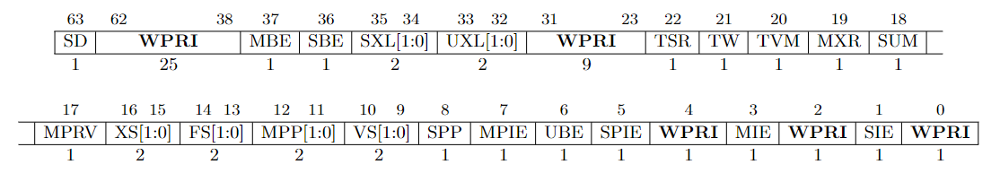
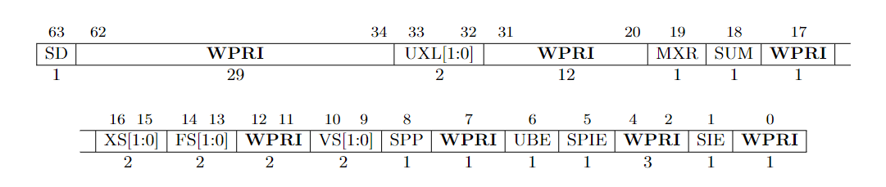
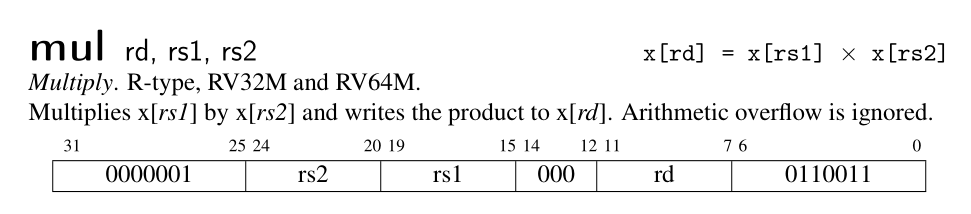
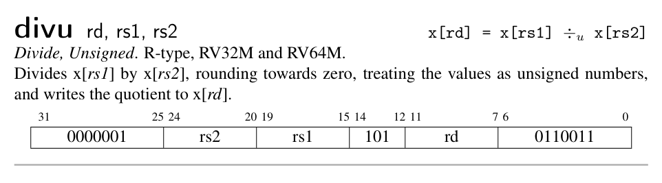
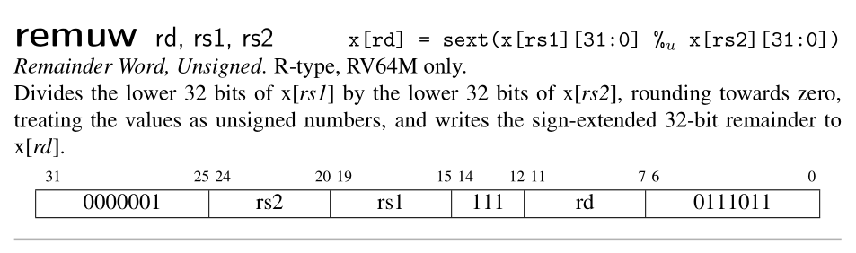
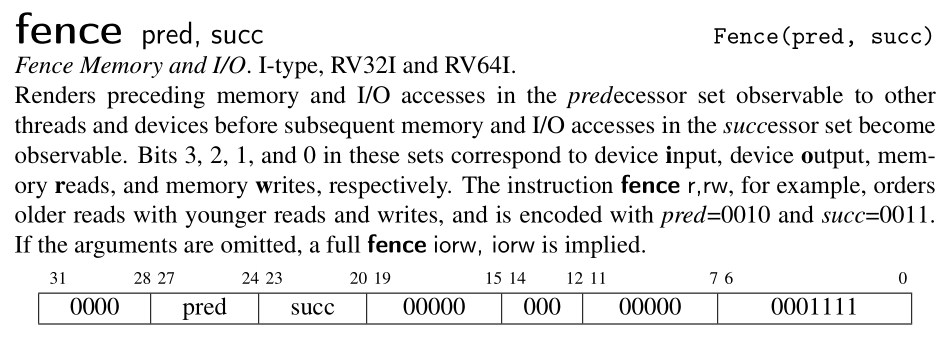
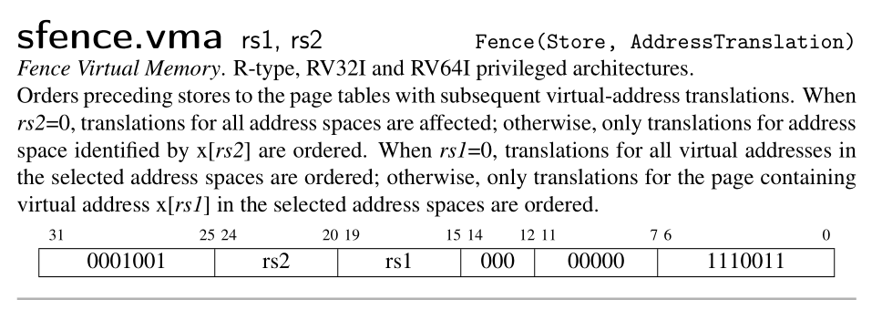

# Privilege Mode

As we have mentioned in last chapter, RISC-V defines three privilege levels: User, Supervisor and Machine. Machine mode is mandatory while other two are optional. The `xv6` operation system requires all the three privilege mode. In this chapter, we will dive into the details of how RISC-V change its privilege mode from one to another. Specifically, we will support two instructions: `sret` and `mret`. These two instructions are used to return from certain privilege mode after trap. We will talk about trap when we move to next chapter `Exception`. 

Additionally, we will also support the standard `A` extension and `M` extension. However, since our simple emulator doesn't support multi-hart, the `A` extension is degenerated as non-atomical instruction. For the same reason, `fence` and `sfence.vma` is implemented as `nop`.

正如我们在上一章所提到过的，RISC-V 定义了三种特权等级：用户、监督和机器。机器模式是必须实现的，而其他模式则是可选的。我们的目标是运行 xv6 操作系统，也就意味着三种模式都要实现才行。

在本章中，我们将探索 RISC-V 特权模式的迁移过程。具体而言，我们将实现两个指令：sret 以及 mret。这两个指令可在陷入（trap in）对应的特权模式之后从中返回。我们会在下一章中讨论异常（trap）。

此外，我们还会直接标准拓展 A 和 M。由于我们的模拟器不支持多个 hart 同时运行，因此，A（原意为原子）中的指令退化为普通的非原子操作指令。同样的，fence 和 sfence.vma 也退化为 nop。

### 1. CPU with privilege mode

Let's start with appending a field `mode` in `Cpu` structure. When a hart is running up, its privilege mode is `Machine`.

我们首先给 CPU 新增一个 mode 字段，且其初始值为 Machine。

```rs
// Riscv Privilege Mode
type Mode = u64;
const User: Mode = 0b00;
const Supervisor: Mode = 0b01;
const Machine: Mode = 0b11;

pub struct Cpu {
    pub regs: [u64; 32],
    pub pc: u64,
    pub mode: Mode,
    pub bus: Bus,
    pub csr: Csr,
}

impl Cpu {
    pub fn new(code: Vec<u8>) -> Self {
        let mut regs = [0; 32];
        regs[2] = DRAM_END;
        let pc = DRAM_BASE;
        let bus = Bus::new(code);
        let csr = Csr::new();
        let mode = Machine;

        Self {regs, pc, bus, csr, mode}
    }
}
```

### 2. SRET & MRET

Before we talk about the behaviour of sret & mret, we need to understand the meaning of different fields in the sstatus & mstatus register.  What I try to descript here is refered to the section 3.1.6 of RISC-V Privileged.

The mstatus register for RV64 is an 64-bit read/write register formatted as following. 

在我们讨论 sret 以及 mret 的行为之前，我们必须先理解 sstatus 以及 mstatus 寄存器上不同字段的含义 。我在此描述的内容出自 RISC-V 特权指令标准的第 3.1.6 节。


<p class="comment">mstatus: Picture from RISC-V Privileged</p>

The mstatus register keeps track of and controls the hart’s current operating state. A restricted view of mstatus appears as the sstatus register in S-mode. mstatus 寄存器表示的当前 hart 的工作状态。sstatus 是它的一个子集。


<p class="comment">sstatus: Picture from RISC-V Privileged</p>

You may have noticed some fields in both status registers are marked as *WPRI* aka. *Write Preserved, Read Ignore*. It means when you perform a write on it, you should keep the fields marked as WPRI unchanged. And when you perform a read on it, you should ignore the value of those fields and regard them as 0. This explains the behavior we read and store the sie, sip and sstatus register in `csr.rs`.

你可能注意到了，在两个状态寄存器中，有些字段被标识为 WPRI，是“写时保留，读时忽略”的缩写。意思是说，当你写这样一个寄存器的时候，不要修改那些标识为 WPRI 的字段；当你读的时候，忽略那些字段，将之视为 0。这可以解释我们在`csr.rs`中对 sie，sip，sstatus 的读写行为。

Global interrupt-enable bits, MIE and SIE, are provided for M-mode and S-mode respectively. When a hart is executing in privilege mode `x`, interrupts are globally enabled when `xIE=1` and globally disabled when `xIE=0`.

To support nested traps, each privilege mode `x` that can respond to interrupts has a two-level stack of interrupt-enable bits and privilege modes. `xPIE` holds the value of the interrupt-enable bit active prior to the trap, and `xPP` holds the previous privilege mode. The `xPP` fields can only hold privilege modes up to `x`, so MPP is two bits wide and SPP is one bit wide. When a trap is taken from privilege mode `y` into privilege mode `x`, `xPIE` is set to the value of `xIE`; `xIE` is set to 0; and `xPP` is set to `y`.

We will implement such a trap token procedure in next chapter.


An MRET or SRET instruction is used to return from a trap in M-mode or S-mode respectively. When executing an xRET instruction, supposing `xPP` holds the value `y`, `xIE` is set to `xPIE`; the privilege mode is changed to `y`; `xPIE` is set to 1; and `xPP` is set to the least-privileged supported mode (U if U-mode is implemented, else M). If `xPP != M`, `xRET` also sets `MPRV=0`. Additionally, `xRET` sets the `pc` to the value stored in the `xepc` register.

Now, we can implement the `sret` and `mret` as following:

MIE 和 SIE 分别是 M 模式和 S 模式的全局中断使能位。假设一个 hart 当前的特权模式是 x，若 xIE=1，则可被中断，否则不可被中断。

为了支持嵌套异常（trap），每个特权模式 x 都有一个两级的栈来保存中断使能位和特权模式信息。xPIE，xPP 分别保存了进入异常之前的中断使能位以及特权模式的值。xPP 只能保存不超过 x 的特权模式，因此，MPP 有两位而 SPP 只有一位。当特权模式 y 陷入到特权模式 x 时。xPIE 被设为 xIE 的值，xPP 被设为 y，xIE 被置 0。

MRET 和 SRET 分别用于从 M-mode 和 S-mode 的异常中返回。当执行 xRET 的时候，xIE 被设置为 xPIE 的值；特权模式被设置为 xPP；xPIE 置 1；xPP 被设置为等级最小的特权模式 （如果支持 U 模式，则是 U 模式，否则就是 M 模式）。如果 xPP 不是 M 模式，则 MPRV 被置 0。此外，xRET 还会设置 PC 的值为 xEPC 寄存器的值。

现在我们可以实现这两个指令了！

<p class="filename">cpu.rs</p>

```rs
impl Cpu {
    // ...
    pub fn execute(&mut self, inst: u64) -> Result<u64, Exception> {
        // ...
        match opcode {
            0x73 => {
                match funct3 {
                    0x0 => {
                        match (rs2, funct7) {
                             (0x2, 0x8) => {
                                // sret
                                // When the SRET instruction is executed to return from the trap
                                // handler, the privilege level is set to user mode if the SPP
                                // bit is 0, or supervisor mode if the SPP bit is 1. The SPP bit
                                // is SSTATUS[8].
                                let mut sstatus = self.csr.load(SSTATUS);
                                self.mode = (sstatus & MASK_SPP) >> 8;
                                // The SPIE bit is SSTATUS[5] and the SIE bit is the SSTATUS[1]
                                let spie = (sstatus & MASK_SPIE) >> 5;
                                // set SIE = SPIE
                                sstatus = (sstatus & !MASK_SIE) | (spie << 1);
                                // set SPIE = 1
                                sstatus |= MASK_SPIE;
                                // set SPP the least privilege mode (u-mode)
                                sstatus &= !MASK_SPP;
                                self.csr.store(SSTATUS, sstatus);
                                // set the pc to CSRs[sepc].
                                // whenever IALIGN=32, bit sepc[1] is masked on reads so that it appears to be 0. This
                                // masking occurs also for the implicit read by the SRET instruction. 
                                let new_pc = self.csr.load(SEPC) & !0b11;
                                return Ok(new_pc);
                            }
                            (0x2, 0x18) => {
                                // mret
                                let mut mstatus = self.csr.load(MSTATUS);
                                // MPP is two bits wide at MSTATUS[12:11]
                                self.mode = (mstatus & MASK_MPP) >> 11;
                                // The MPIE bit is MSTATUS[7] and the MIE bit is the MSTATUS[3].
                                let mpie = (mstatus & MASK_MPIE) >> 7;
                                // set MIE = MPIE
                                mstatus = (mstatus & !MASK_MIE) | (mpie << 3);
                                // set MPIE = 1
                                mstatus |= MASK_MPIE;
                                // set MPP the least privilege mode (u-mode)
                                mstatus &= !MASK_MPP;
                                // If MPP != M, sets MPRV=0
                                mstatus &= !MASK_MPRV;
                                self.csr.store(MSTATUS, mstatus);
                                // set the pc to CSRs[mepc].
                                let new_pc = self.csr.load(MEPC) & !0b11;
                                return Ok(new_pc);
                            }
                            // ...
                        }
                    }
                }
            }
        }
    }
}
```

### 3. A & M extension

Since our emulator is single-threaded, we don't need to worry about atomic operations. Thus the instruction set defined in A extension is implemented as non-atomic operations. 

The M extension defines several instructions that can be used to perform multiplication and division. It seems that we just need the following instructions to run xv6 up.

由于我们的模拟器是单线程的，我们不需要考虑原子操作。因此，我们只按非原子操作的方式实现 A 拓展中的指令。

M 拓展中定义了用于执行乘除的指令，不过，为了让 xv6 能够运行起来，我们只需要实现以下指令即可。







<p class="comment">Picture from RISC-V Reader</p>


### 4. FENCE / SFENCE.VMA

For the reason we have mentioned above, we simplify both instructions as nop.

基于以上原因，这两个指令可以简化为 nop。





<p class="comment">Picture from RISC-V Reader</p>


### 5. Case Study: xv6

To make our emulator more concrete, let's take a look at the source code `start.c` of xv6. In the following piece of code. The `MPP` field of `mstatus` is set to `S`. So when a `mret` is executed, the privilege mode is changed to S-mode.

我们来看下 xv6 是如何进入 S 模式的。在一开始，xv6 就将 mstatus 的 MPP 域设置为 S。这样一来，当 mret 执行时，就会进入 S 模式。

```c
void start()
{
  // set M Previous Privilege mode to Supervisor, for mret.
  unsigned long x = r_mstatus();
  x &= ~MSTATUS_MPP_MASK;
  x |= MSTATUS_MPP_S;
  w_mstatus(x);
  // ...
}
```

### 6. Conclusion

We have introduced RISC-V privilege level in this chapter and implement the SRET and MRET instructions according to the RISC-V Privileged. We also support the standard A & M extension. Since our emulator is single-threaded, we simplify many instructions in such a context.  However, the story in this chapter is incomplete since we haven't mentioned how CPU trap in certain privilege mode. This is the topic of next chapter.

这一章中，我们引入了 RISC-V 的特权模式并实现了 SRET 和 MRET 两个指令。我们还添加了对标准拓展 A 和 M 的支持。由于我们的模拟器是单线程的，我们简化了许多指令。然而，本章的故事其实是不完整的，因为我们不知道 CPU 是如何陷入到特定特权模式的，我们将在下一章中探讨这个话题。