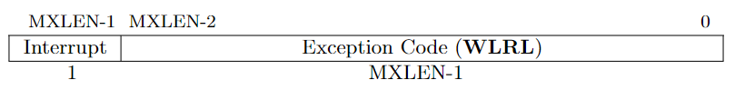
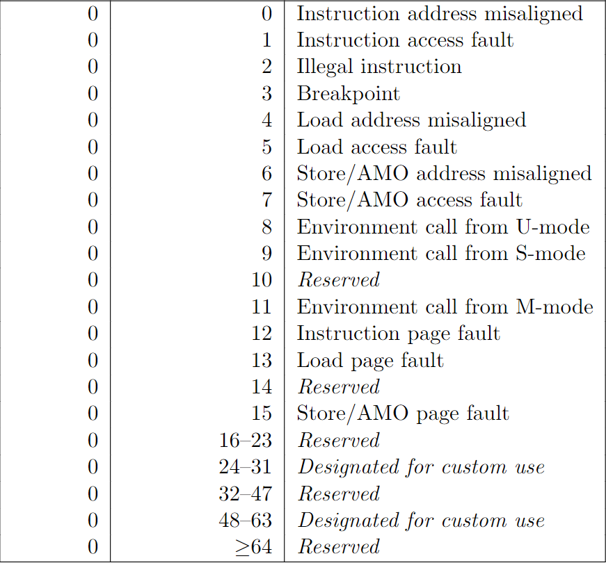

# Exception

In fact, we have already learned how to use `Exception`. In the preceding chapter, when `execute` encounters an illegal instruction, it returns an exception to the `main` function. Then the `main` function will print the exception, break the loop and finally exits. In this chapter, we will handle exception properly rather than just terminate the program.

The following text comes from the RISC-V unprivileged ISA:

In RISC-V hart, we use the term exception to refer to an unusual condition occurring at run time associated with an instruction in the current RISC-V hart. We use the term interrupt to refer to an external asynchronous event that may cause a RISC-V hart to experience an unexpected transfer of control.  We use the term trap to refer to the transfer of control to a trap handler caused by either an exception or an interrupt.

RISC-V also defines four types of trap. What we need here is the fatal trap. When we encounter a fatal trap, we will terminate the emulator.

### 1. Exception type

RISC-V has defined 14 exception types. When a trap is taken into M-mode, `mcause` is written with a code indicating the event that causes the trap, while `mtval` may be written with exception-specific information to assist software in handling the trap. Trap taken in S-mode is similar.

The cause registers contain an interrupt bit and a 15-bit exception code. The interrupt bit is set when the trap is caused by an interrupt. We will talk more about interrupt in next three chapters.


<p class="comment">mcause or scause register. From RISC-V Privileged<p>


<p class="comment">Exception type and code. From RISC-V Privileged<p>

For trap value register, RISC-V defines following rules:
+ If stval or mtval is written with a nonzero value when a breakpoint, address-misaligned, access-fault, or page-fault exception occurs on an instruction fetch, load, or store, then stval will contain the faulting virtual address.  
+ If stval or mtval is written with a nonzero value when a misaligned load or store causes an access-fault or page-fault exception, then stval will contain the virtual address of the portion of the access that caused the fault
+ The stval and mtval register can optionally also be used to return the faulting instruction bits on an illegal instruction exception.

### 2. Exception Implementation

Let's take a close look at the `exception.rs`, which have stayed in our src directory for a long time.

<p class="filename">exception.rs</p>

```rs
#[derive(Debug, Copy, Clone)]
pub enum Exception {
    InstructionAddrMisaligned(u64),
    InstructionAccessFault(u64),
    IllegalInstruction(u64),
    Breakpoint(u64),
    LoadAccessMisaligned(u64),
    LoadAccessFault(u64),
    StoreAMOAddrMisaligned(u64),
    StoreAMOAccessFault(u64),
    EnvironmentCallFromUMode(u64),
    EnvironmentCallFromSMode(u64),
    EnvironmentCallFromMMode(u64),
    InstructionPageFault(u64),
    LoadPageFault(u64),
    StoreAMOPageFault(u64),
}
```

The `trap value` captured by each exception will be stored in the `stval` or `mtval`, which may have different meaning depends on the type of exception as we have mentioned above.

We implement the `value` function to return the trap value and the `code` function to return the exception code. We have also provided a function `is_fatal`, which determines whether the exception is fatal.

<p class="filename">exception.rs</p>

```rs
impl Exception {
    pub fn value(self) -> u64 {
        match self {
            InstructionAddrMisaligned(addr) => addr,
            InstructionAccessFault(addr) => addr,
            IllegalInstruction(inst) => inst,
            Breakpoint(pc) => pc,
            LoadAccessMisaligned(addr) => addr,
            LoadAccessFault(addr) => addr,
            StoreAMOAddrMisaligned(addr) => addr,
            StoreAMOAccessFault(addr) => addr,
            EnvironmentCallFromUMode(pc) => pc,
            EnvironmentCallFromSMode(pc) => pc,
            EnvironmentCallFromMMode(pc) => pc,
            InstructionPageFault(addr) => addr,
            LoadPageFault(addr) => addr,
            StoreAMOPageFault(addr) => addr,
        }
    }

    pub fn code(self) -> u64 {
        match self {
            InstructionAddrMisaligned(_) => 0,
            InstructionAccessFault(_) => 1,
            IllegalInstruction(_) => 2,
            Breakpoint(_) => 3,
            LoadAccessMisaligned(_) => 4,
            LoadAccessFault(_) => 5,
            StoreAMOAddrMisaligned(_) => 6,
            StoreAMOAccessFault(_) => 7,
            EnvironmentCallFromUMode(_) => 8,
            EnvironmentCallFromSMode(_) => 9,
            EnvironmentCallFromMMode(_) => 11,
            InstructionPageFault(_) => 12,
            LoadPageFault(_) => 13,
            StoreAMOPageFault(_) => 15,
        }
    }

    pub fn is_fatal(self) -> bool {
        match self {
            InstructionAddrMisaligned(_)
            | InstructionAccessFault(_)
            | LoadAccessFault(_)
            | StoreAMOAddrMisaligned(_)
            | StoreAMOAccessFault(_) 
            | IllegalInstruction(_) => true,
            _else => false,
        }
    }
}
```

### 3. Handle exception in CPU

We summarize the whole procedure of handling exception as following:

1. set xPP to current mode.
2. update hart's privilege mode (M or S according to current mode and exception setting).
3. save current pc in epc (sepc in S-mode, mepc in M-mode)
4. set pc to trap vector (stvec in S-mode, mtvec in M-mode)
5. set cause register with exception code (scause in S-mode, mcause in M-mode)
6. set trap value properly (stval in S-mode, mtval in M-mode)
7. set xPIE to xIE (SPIE in S-mode, MPIE in M-mode)
8. clear up xIE (SIE in S-mode, MIE in M-mode)

The code to implement such a procedure is straightforward.


<p class="filename">cpu.rs</p>

```rs
impl Cpu {
    pub fn handle_exception(&mut self, e: Exception) {
        let pc = self.pc; 
        let mode = self.mode;
        let cause = e.code();
        // if an exception happen in U-mode or S-mode, and the exception is delegated to S-mode.
        // then this exception should be handled in S-mode.
        let trap_in_s_mode = mode <= Supervisor && self.csr.is_medelegated(cause);
        let (STATUS, TVEC, CAUSE, TVAL, EPC, MASK_PIE, pie_i, MASK_IE, ie_i, MASK_PP, pp_i) 
            = if trap_in_s_mode {
                self.mode = Supervisor;
                (SSTATUS, STVEC, SCAUSE, STVAL, SEPC, MASK_SPIE, 5, MASK_SIE, 1, MASK_SPP, 8)
            } else {
                self.mode = Machine;
                (MSTATUS, MTVEC, MCAUSE, MTVAL, MEPC, MASK_MPIE, 7, MASK_MIE, 3, MASK_MPP, 11)
            };
        // 3.1.7 & 4.1.2
        // The BASE field in tvec is a WARL field that can hold any valid virtual or physical address,
        // subject to the following alignment constraints: the address must be 4-byte aligned
        self.pc = self.csr.load(TVEC) & !0b11;
        // 3.1.14 & 4.1.7
        // When a trap is taken into S-mode (or M-mode), sepc (or mepc) is written with the virtual address 
        // of the instruction that was interrupted or that encountered the exception.
        self.csr.store(EPC, pc);
        // 3.1.15 & 4.1.8
        // When a trap is taken into S-mode (or M-mode), scause (or mcause) is written with a code indicating 
        // the event that caused the trap.
        self.csr.store(CAUSE, cause);
        // 3.1.16 & 4.1.9
        // If stval is written with a nonzero value when a breakpoint, address-misaligned, access-fault, or
        // page-fault exception occurs on an instruction fetch, load, or store, then stval will contain the
        // faulting virtual address.
        // If stval is written with a nonzero value when a misaligned load or store causes an access-fault or
        // page-fault exception, then stval will contain the virtual address of the portion of the access that
        // caused the fault
        self.csr.store(TVAL, e.value());
        // 3.1.6 covers both sstatus and mstatus.
        let mut status = self.csr.load(STATUS);
        // get SIE or MIE
        let ie = (status & MASK_IE) >> ie_i;
        // set SPIE = SIE / MPIE = MIE
        status = (status & !MASK_PIE) | (ie << pie_i);
        // set SIE = 0 / MIE = 0
        status &= !MASK_IE; 
        // set SPP / MPP = previous mode
        status = (status & !MASK_PP) | (mode << pp_i);
        self.csr.store(STATUS, status);
    }
}
```