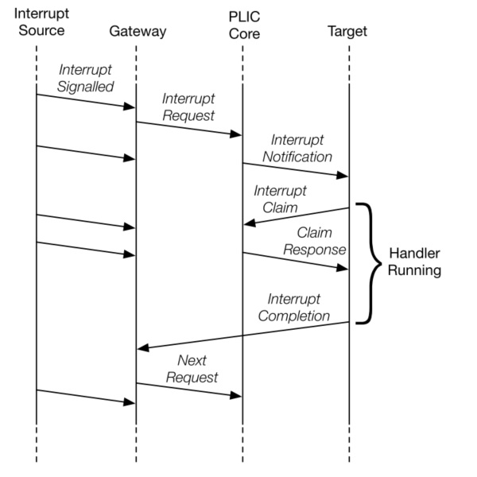

# PLIC & CLINT

From this chapter, we will start to support several IO devices. Firstly, let's take a look at the PLIC and CLINT.

RISC-V PLIC Specification is available at this Github [repo](https://github.com/riscv/riscv-plic-spec/blob/master/riscv-plic.adoc). This is recommanded to read it first. I have quoted many content from this Spec in this chapter.

从本节开始，我们将支持几个 IO 设备。首先是 PLIC 和 CLINT。

RISC-V 的 PLIC 标准可在个 Github [仓库](https://github.com/riscv/riscv-plic-spec/blob/master/riscv-plic.adoc)查看。推荐先读下这个文档，我在下文引用了许多文档中的内容。

### 1. PLIC

#### 1.1 Interrupt Source

At most one interrupt request per interrupt source can be pending in the PLIC core at any time, indicated by setting the source’s IP bit. The gateway only forwards a new interrupt request to the PLIC core after receiving notification that the interrupt handler servicing the previous interrupt request from the same source has completed.

中断源指的是外部的设备信号，对于每个中断源，PLIC 会顺序处理它的信号。中断源通过在中断等待寄存器（IP）中对应的位置 1 来发起中断请求。

#### 1.2 Interrupt Notifications

If the target is a RISC-V hart context, the interrupt notifications arrive on the meip/heip/seip/ueip bits depending on the privilege level of the hart context.

The PLIC hardware only supports multicasting of interrupts, such that all enabled targets will receive interrupt notifications for a given active interrupt.

PLIC 通过在 xstatus 寄存器中设置对应的位（meip/heip/seip/ueip）来通知 RISC-V hart 有外部中断需要处理。PLIC 会对中断进行广播，因此，所有能够响应该中断的 hart 都能收到通知。然后，最后只有一个 hart 能够成功进行响应。

#### 1.3 Interrupt Identifiers (IDs)

Global interrupt sources are assigned small unsigned integer identifiers, beginning at the value 1. An interrupt ID of 0 is reserved to mean “no interrupt”.

Interrupt identifiers are also used to break ties when two or more interrupt sources have the same assigned priority. Smaller values of interrupt ID take precedence over larger values of interrupt ID.

RISC-V 共定义了 1024 个中断 ID，其中 0 表示没有任何中断。中断 ID 可以用于中断仲裁。当所有的中断优先级相同时，PLIC 会优先广播 ID 最小的中断。

#### 1.4 Interrupt Flow

Below figure shows the messages flowing between agents when handling interrupts via the PLIC.

+ Global interrupts are sent from their source to an interrupt gateway that processes the interrupt signal from each source
+ Interrupt gateway then sends a single interrupt request to the PLIC core, which latches these in the core interrupt pending bits (IP).
+ The PLIC core forwards an interrupt notification to one or more targets if the targets have any pending interrupts enabled, and the priority of the pending interrupts exceeds a per-target threshold.
+ When the target takes the external interrupt, it sends an interrupt claim request to retrieve the identifier of the highest priority global interrupt source pending for that target from the PLIC core.
+ PLIC core then clears the corresponding interrupt source pending bit.
+ After the target has serviced the interrupt, it sends the associated interrupt gateway an interrupt completion message
+ The interrupt gateway can now forward another interrupt request for the same source to the PLIC.

中断处理流程

+ 中断源向中断网关发起中断请求信号
+ 对于每一个中断源，中断网关只会发送一个信号给 PLIC，PLIC 于是在 IP 中将该中断源 ID 置 1。
+ 若该中断的优先级高于 hart 的阈值，则该 hart 会收到来自 PLIC 的广播。
+ 当 hart 响应这个中断时。它会发一个响应通知给 PLIC。（通过读取 claim/complete 寄存器获取中断源 ID 的同时通知 PLIC）
+ PLIC 现在会将该中断源清零。然而 meip/heip/seip/ueip 不一定会清零。中断程序可以在退出前进行检查以便继续处理其他中断。
+ 当该中断完成后，hart 通知网关。
+ 网关现在可以再发一个该中断源的中断信号了。

#### 1.5 Operation Parameters

General PLIC operation parameter register blocks are defined in this spec, those are:

+ Interrupt Priorities registers: The interrupt priority for each interrupt source.
+ Interrupt Pending Bits registers: The interrupt pending status of each interrupt source.
+ Interrupt Enables registers: The enablement of interrupt source of each context.
+ Priority Thresholds registers: The interrupt priority threshold of each context.
+ Interrupt Claim registers: The register to acquire interrupt source ID of each context.
+ Interrupt Completion registers: The register to send interrupt completion message to the associated gateway.

标准中定义了以下的通用 PLIC 操作参数寄存器类型：

+ 中断优化级寄存器：用于设置每个中断源的优先级
+ 中断等待寄存器：用于表示是否发生了该中断，每个寄存器上有 32 位，可以表示 32 个中断源的状态。
+ 中断使能寄存器：每个 hart 持有一组寄存器，用于表示它是否开启了该中断
+ 优先级阈值寄存器：每个 hart 持有一个寄存器，当接受大于该阈值的中断请求
+ 中断声明寄存器：每个 hart 持有一个，通过读该寄存器来获取中断源 ID，同时向 PLIC 发起声明。
+ 中断完成寄存器：每个 hart 持有一个，通过写该寄存器来通知网关该中断源已经被处理。

#### 1.6 Memory Map

The base address of PLIC Memory Map is platform implementation-specific.

    base + 0x000000: Reserved (interrupt source 0 does not exist)
    base + 0x000004: Interrupt source 1 priority
    base + 0x000008: Interrupt source 2 priority
    ...
    base + 0x000FFC: Interrupt source 1023 priority
    base + 0x001000: Interrupt Pending bit 0-31
    base + 0x00107C: Interrupt Pending bit 992-1023
    ...
    base + 0x002000: Enable bits for sources 0-31 on context 0
    base + 0x002004: Enable bits for sources 32-63 on context 0
    ...
    base + 0x00207C: Enable bits for sources 992-1023 on context 0
    base + 0x002080: Enable bits for sources 0-31 on context 1
    base + 0x002084: Enable bits for sources 32-63 on context 1
    ...
    base + 0x0020FC: Enable bits for sources 992-1023 on context 1
    base + 0x002100: Enable bits for sources 0-31 on context 2
    base + 0x002104: Enable bits for sources 32-63 on context 2
    ...
    base + 0x00217C: Enable bits for sources 992-1023 on context 2
    ...
    base + 0x1F1F80: Enable bits for sources 0-31 on context 15871
    base + 0x1F1F84: Enable bits for sources 32-63 on context 15871
    base + 0x1F1FFC: Enable bits for sources 992-1023 on context 15871
    ...
    base + 0x1FFFFC: Reserved
    base + 0x200000: Priority threshold for context 0
    base + 0x200004: Claim/complete for context 0
    base + 0x200008: Reserved
    ...
    base + 0x200FFC: Reserved
    base + 0x201000: Priority threshold for context 1
    base + 0x201004: Claim/complete for context 1
    ...
    base + 0x3FFF000: Priority threshold for context 15871
    base + 0x3FFF004: Claim/complete for context 15871
    base + 0x3FFF008: Reserved
    ...
    base + 0x3FFFFFC: Reserved

Read the Spec from details for each operation parameter.

### 2. CLINT

CLINT is used to generate timer interrupt and software interrupt. Refer to *Section 3.2.1 Machine Timer Registers (mtime and mtimecmp)* of RISC-V privileged for more information.

CLINT 是用于生产时钟中断和软件中断的设备。可以看下 RISC-V 特权架构文档的 3.2.1 节。

### 3. Implementation

Although these two devices are vital in real hardware, our emulator is too simple to imitate timer interrupt. The PLIC and CLINT in our emulator almost do nothing at all. (We will use a bit of PLIC in chapter 8.) Nevertheless, we provide some background and a dummy implementation.

Read the code in `plic.rs` and `clint.rs`. The parameters are defined in `param.rs`. Try to search the source code of chapter 10 to find out how these modules are used in the final version. 

虽然这两个设备都是非常重要的，但在我们的模拟器中，它们几乎啥也没做。我们只会在第 8 章用到一点 PLIC。不管怎样，我们提供了一些背景信息以及一个简单的实现。

你可以查看相关的代码，可以在第 10 章的代码中搜索一下这两个模块，看看这两个模块是怎么使用的。

### 4. Conclusion

I will feel discouraged if I were you. We have learned some theory about PLIC and CLINT but these two devices just do nothing meaningful in our emulator! Just a joke. In fact, I believe *less is more*. Sometimes we just want to throw something to get the main idea. I promise to provide a valuable reference for you at the end of this tutorial.

如果我是你，我会感到失望。因为我们学习了关于 PLIC 和 CLINT 的理论知识，但是我们的模拟器却基本不用它们！开玩笑的！事实上，我相信“少即是多”的理念。有时候确实不应该管那么多，掌握核心思想是最重要的。在这个教程的结尾，我承诺提供一个更有参考价值的实现。

