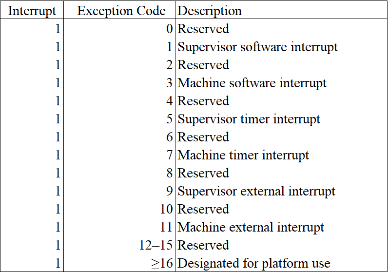
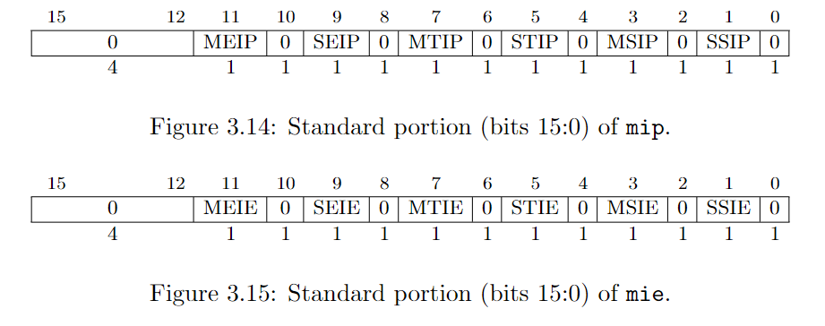
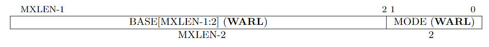

# Interrupt

Interrupt is an external event generated by peripheral devices. CPU will handle an interrupt after it have fully executed an instruction, which is quite difference from handling exceptions. Consequently, when CPU encounters an exception, the PC points to the instruction that causes the exception. When CPU encounters an interrupt, the PC points to the instruction that it haven't executed.

中断是一个由外围设备产生的事件。CPU 会在它执行完一条完整指令之后处理中断，这一点不同于对异常的处理。当 CPU 遇到异常时，PC 会指向那个造成这个异常的指令。当 CPU 遇到中断时，PC 会指向一个指令它原准备要执行的指令。

### 1. Interrupt type

RISC-V has defined six interrupt types. 

RISC-V 现有 6 种异常状态。



<p class="comment">mcause/scause and interrupt code. From RISC-V Privileged<p>

The software interrupt and timer interrupt are generated by CLINT, while the external interrupt is generated by PLIC as we have mentioned in last chapter.

When an interrupt is generated, corresponding field in mip/sip is set to 1. Fields in mie/sie controls whether the corresponding interrupt is enabled or disabled.

我们在上一节中已提过，软件中断和时钟中断是由 CLINT 产生的，外部中断是由 PLIC 产生的。

当发生中断时，mip/sip 上相应的位会置 1，mie/sie 的字段启动或者屏蔽特定的中断。



When a hart is executing in privilege mode x, interrupts are globally enabled when xIE=1 and globally disabled when xIE=0. Interrupts for lower-privilege modes, w < x, are always globally disabled regardless of the setting of any global wIE bit for the lower-privilege mode. Interrupts for higher-privilege modes, y > x, are always globally enabled regardless of the setting of the global yIE bit for the higher-privilege mode. Higher-privilege-level code can use separate per-interrupt enable bits to disable selected higher-privilege-mode interrupts before ceding control to a lower-privilege mode.

An interrupt i will trap to M-mode (causing the privilege mode to change to M-mode) if all of the following are true: (a) either the current privilege mode is M and the MIE bit in the mstatus register is set, or the current privilege mode has less privilege than M-mode; (b) bit i is set in both mip and mie; and (c) if register mideleg exists, bit i is not set in mideleg.

Trap in S-mode is quite similarly.

Multiple simultaneous interrupts destined for M-mode are handled in the following decreasing priority order: MEI, MSI, MTI, SEI, SSI, STI.

Read the Section 3.1.6.1, 3.1.9 and 4.1.3 of RISC-V Privileged for more information.

当一个 hart 运行在特权模式 x 时，若 xIE=1 则中断全局可用，否则全局中断被屏蔽。对于特权等级小于 x 的，其全局中断总是被屏蔽的。对于特权等级高于 x 的，其全局中断总是开启的。较高级特权模式在进入较低级的模式之前，可以先禁用掉某些中断，这样，即便是在低等级的模式下，也不会响应那些中断。

一个中断 i 要陷入到 M 模式，需要满足以下条件：（a）当前的模式是 M 且 MIE=1，或当前模式比 M 模式低级；（b）mip 和 mie 中相应的位 i 都为 1；（c）如果存在 mideleg 寄存器，mideleg 中的 i 位为 0.

陷入到 S 模式与此相似。

若有多个中断同时到达，M 模式将会按以下优化级顺序处理：MEI，MSI，MTI，SEI，SSI，STI。

RISC-V 特权架构文档的 3.1.6.1, 3.1.9 和 4.1.3 节有更多详细的内容。

### 2. Interrupt handle

The procedure of handling interrupt is similar to that of handling exception. For convenience, I summarize the process as follows:

1. update hart's privilege mode (M or S according to current mode and exception setting).
2. save current pc in epc (sepc in S-mode, mepc in M-mode)
3. set pc properly according to the MODE field of trap vector (stvec in S-mode, mtvec in M-mode)
4. set cause register with exception code (scause in S-mode, mcause in M-mode)
5. set xPIE to xIE (SPIE in S-mode, MPIE in M-mode)
6. clear up xIE (SIE in S-mode, MIE in M-mode)
7. set xPP to previous mode.

There are two different points compared with exception. First, we omit the set up of trap value. Second, we have to set up the pc according to the MODE field of trap vector.

中断的处理过程与异常是非常相似的。为方便起见，我们将该过程总结如下：

1. 更新 hart 的特权模式
2. 保存 pc 至 epc
3. 根据 trap vector 的 MODE 字段的值来设置 pc。
4. 保存中断的异常代码到 cause 寄存器中
5. 令 xPIE = xIE
6. 令 xIE = 0
7. 将进入中断前的模式保存到 xPP 中

以上有两个地方是与异常不同的。一是我们不需要处理 trap value。二是我们要根据 trap vector 的 MODE 字段的值来设置 PC。



<p class=comment>trap vector</p>


<p class=comment>encoding of trap vector MODE field.</p>

Read the Section 3.1.7 in RISC-V Privileged for more details.

RISC-V 特权架构文档的 3.1.7 节有更多详细内容。

### 3. Implementation

The interrupt enum is defined in `interrupt.rs`. Since we don't have to deal with trap value, the interrupt structure only owns a `code` method.

中断的数据结构定义在 `interrupt.rs` 中。因为我们不再需要处理 trap value，所以只需要一个 code 方法。

<p class="filename">interrupt.rs</p>

```rs
pub const MASK_INTERRUPT_BIT: u64 = 1 << 63;

#[derive(Debug, Copy, Clone)]
pub enum Interrupt {
    SupervisorSoftwareInterrupt,
    MachineSoftwareInterrupt,
    SupervisorTimerInterrupt,
    MachineTimerInterrupt,
    SupervisorExternalInterrupt,
    MachineExternalInterrupt,
}


impl Interrupt {
    pub fn code(self) -> u64 {
        use Interrupt::*;
        match self {
            SupervisorSoftwareInterrupt => 1 | MASK_INTERRUPT_BIT,
            MachineSoftwareInterrupt => 3 | MASK_INTERRUPT_BIT,
            SupervisorTimerInterrupt => 5 | MASK_INTERRUPT_BIT,
            MachineTimerInterrupt => 7 | MASK_INTERRUPT_BIT,
            SupervisorExternalInterrupt => 9 | MASK_INTERRUPT_BIT,
            MachineExternalInterrupt => 11 | MASK_INTERRUPT_BIT,
        }
    }
}
```

There are two places we need to modify to enable interrupt handling. One is in `cpu.rs`, another is in `main.rs`.

Firstly, we need to introduce interrupt handling for our cpu.

有两个地方需要改动：一个在 cpu.rs，还有一个在 main.rs。

<p class="filename">cpu.rs</p>

```rs
impl Cpu {
    pub fn handle_interrupt(&mut self, interrupt: Interrupt) {
        // similar to handle exception
        let pc = self.pc; 
        let mode = self.mode;
        let cause = interrupt.code();
        // although cause contains a interrupt bit. Shift the cause make it out.
        let trap_in_s_mode = mode <= Supervisor && self.csr.is_midelegated(cause);
        let (STATUS, TVEC, CAUSE, TVAL, EPC, MASK_PIE, pie_i, MASK_IE, ie_i, MASK_PP, pp_i) 
            = if trap_in_s_mode {
                self.mode = Supervisor;
                (SSTATUS, STVEC, SCAUSE, STVAL, SEPC, MASK_SPIE, 5, MASK_SIE, 1, MASK_SPP, 8)
            } else {
                self.mode = Machine;
                (MSTATUS, MTVEC, MCAUSE, MTVAL, MEPC, MASK_MPIE, 7, MASK_MIE, 3, MASK_MPP, 11)
            };
        // 3.1.7 & 4.1.2
        // When MODE=Direct, all traps into machine mode cause the pc to be set to the address in the BASE field. 
        // When MODE=Vectored, all synchronous exceptions into machine mode cause the pc to be set to the address 
        // in the BASE field, whereas interrupts cause the pc to be set to the address in the BASE field plus four 
        // times the interrupt cause number. 
        let tvec = self.csr.load(TVEC);
        let tvec_mode = tvec & 0b11;
        let tvec_base = tvec & !0b11;
        match tvec_mode { // DIrect
            0 => self.pc = tvec_base,
            1 => self.pc = tvec_base + cause << 2,
            _ => unreachable!(),
        };
        // 3.1.14 & 4.1.7
        // When a trap is taken into S-mode (or M-mode), sepc (or mepc) is written with the virtual address 
        // of the instruction that was interrupted or that encountered the exception.
        self.csr.store(EPC, pc);
        // 3.1.15 & 4.1.8
        // When a trap is taken into S-mode (or M-mode), scause (or mcause) is written with a code indicating 
        // the event that caused the trap.
        self.csr.store(CAUSE, cause);
        // 3.1.16 & 4.1.9
        // When a trap is taken into M-mode, mtval is either set to zero or written with exception-specific 
        // information to assist software in handling the trap. 
        self.csr.store(TVAL, 0);
        // 3.1.6 covers both sstatus and mstatus.
        let mut status = self.csr.load(STATUS);
        // get SIE or MIE
        let ie = (status & MASK_IE) >> ie_i;
        // set SPIE = SIE / MPIE = MIE
        status = (status & !MASK_PIE) | (ie << pie_i);
        // set SIE = 0 / MIE = 0
        status &= !MASK_IE; 
        // set SPP / MPP = previous mode
        status = (status & !MASK_PP) | (mode << pp_i);
        self.csr.store(STATUS, status);
    }
}
```

We have also implemented a function `check_pending_interrupt` for checking whether there is a pending interrupt. 

此外，我们需要实现一个函数来检查是否有中断需要处理。

<p class="filename">cpu.rs</p>

```rs
impl Cpu {
    // ...
    pub fn check_pending_interrupt(&mut self) -> Option<Interrupt> {
        use Interrupt::*;
        if (self.mode == Machine) && (self.csr.load(MSTATUS) & MASK_MIE) == 0 {
            return None;
        }
        if (self.mode == Supervisor) && (self.csr.load(SSTATUS) & MASK_SIE) == 0 {
            return None;
        }
        
        // In fact, we should using priority to decide which interrupt should be handled first.
        if self.bus.uart.is_interrupting() {
            self.bus.store(PLIC_SCLAIM, 32, UART_IRQ).unwrap();
            self.csr.store(MIP, self.csr.load(MIP) | MASK_SEIP); 
        } 
        // 3.1.9 & 4.1.3
        // Multiple simultaneous interrupts destined for M-mode are handled in the following decreasing
        // priority order: MEI, MSI, MTI, SEI, SSI, STI.
        let pending = self.csr.load(MIE) & self.csr.load(MIP);

        if (pending & MASK_MEIP) != 0 {
            self.csr.store(MIP, self.csr.load(MIP) & !MASK_MEIP);
            return Some(MachineExternalInterrupt);
        }
        if (pending & MASK_MSIP) != 0 {
            self.csr.store(MIP, self.csr.load(MIP) & !MASK_MSIP);
            return Some(MachineSoftwareInterrupt);
        }
        if (pending & MASK_MTIP) != 0 {
            self.csr.store(MIP, self.csr.load(MIP) & !MASK_MTIP);
            return Some(MachineTimerInterrupt);
        }
        if (pending & MASK_SEIP) != 0 {
            self.csr.store(MIP, self.csr.load(MIP) & !MASK_SEIP);
            return Some(SupervisorExternalInterrupt);
        }
        if (pending & MASK_SSIP) != 0 {
            self.csr.store(MIP, self.csr.load(MIP) & !MASK_SSIP);
            return Some(SupervisorSoftwareInterrupt);
        }
        if (pending & MASK_STIP) != 0 {
            self.csr.store(MIP, self.csr.load(MIP) & !MASK_STIP);
            return Some(SupervisorTimerInterrupt);
        }
        return None;
    }
}
```

Finally, we handle an interrupt (if any) at the end of the execution loop.

最后，我们在执行循环中添加对中断的处理。

<p class="filename">main.rs</p>

```rs
main() {
    // ...
    loop {
        let inst = match cpu.fetch() {
            Ok(inst) => inst,
            Err(e) => {
                cpu.handle_exception(e);
                if e.is_fatal() {
                    println!("{}", e);
                    break;
                }
                continue;
            }
        };

        match cpu.execute(inst) {
            Ok(new_pc) => cpu.pc = new_pc,
            Err(e) => {
                cpu.handle_exception(e);
                if e.is_fatal() {
                    println!("{}", e);
                    break;
                }
            }
        };

        match cpu.check_pending_interrupt() {
            Some(interrupt) => cpu.handle_interrupt(interrupt),
            None => (),
        }
    }
}
```

### 4. Conclusion

We have dived into the details of how RISC-V handle interrupt in this chapter. Sometimes, exception and interrupt is considered confusing. I hope this chapter and chapter 5 will help you to distinguish them. Next chapter, we will take about VirtIO, a virtual device family containing a virtual disk that we can perform disk IO on it.


在本章中，我们探索了 RISC-V 处理中断的细节。有时候，异常和中断会让人有点混淆。我希望本章和第五章能够帮你理清它们的区别。在下一章，我们会讨论 virtIO。virtIO 是一个虚拟设备家族，其中包括了一个虚拟磁盘，我们将在上面执行相关的 IO 指令。